# **4. PROJETO DO DESIGN DE INTERAÇÃO**

## **4.1 Personas**

Nesta seção você deve detalhar as personas do seu projeto. Deve-se documentar uma persona por integrante do projeto. Para mais informações sobre personas consulte: [RDStation, o que é persona](https://www.rdstation.com/blog/marketing/persona-o-que-e/). Sugere-se a utilização de um template do Canva: [modelos de persona no Canva](https://www.canva.com/pt_br/modelos/s/persona/).

### 4.1.1 João

### 4.1.2 Matheus

### 4.1.3 Ana

### 4.1.4 Carla

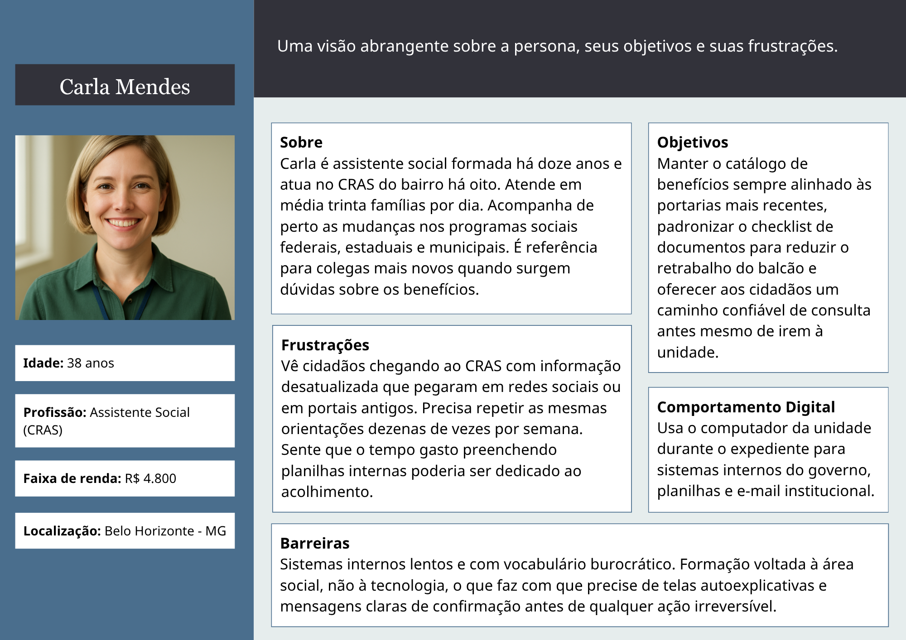

## **4.2 Mapa de Empatia**

Mapa da Empatia é um material utilizado para conhecer melhor o seu cliente. A partir do mapa da empatia é possível detalhar a personalidade do cliente e compreendê-la melhor. O objetivo é obter um nível mais profundo de compreensão de uma persona. A seguir um exemplo de template que pode ser usado para o mapa de empatia. Para cada persona deverá ser apresentado o seu respectivo mapa de empatia. Sugere-se a utilização do template apresentado em [RDStation, mapa da empatia](https://www.rdstation.com/blog/marketing/mapa-da-empatia/).

### 4.2.1 João

### 4.2.2 Matheus

### 4.2.3 Ana

### 4.2.4 Carla

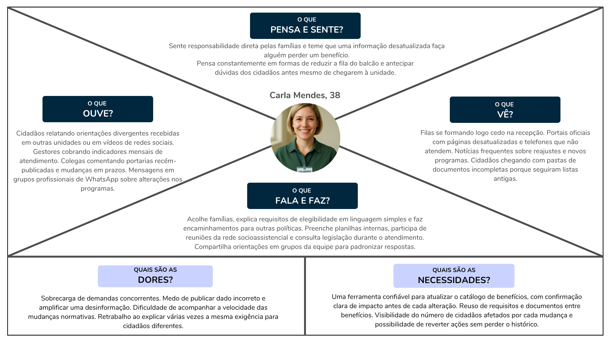

## **4.3 Protótipos das Interfaces**

#### **Painel Inicial**

<table>
<thead>
<tr><th colspan="4" align="left"><strong>Tabela 1:</strong> Telas do Painel Inicial do Visitante </th></tr>
</thead>
<tbody>
<tr>
<td width="33%">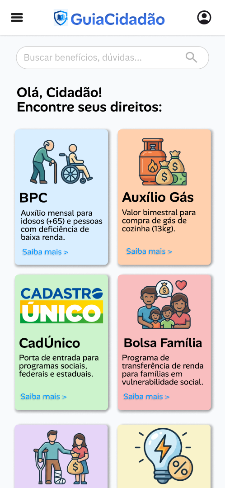</td>
<td width="33%">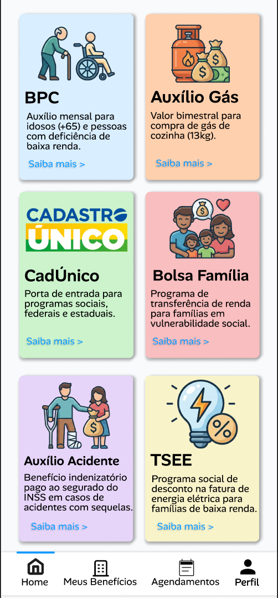</td>
<td width="33%">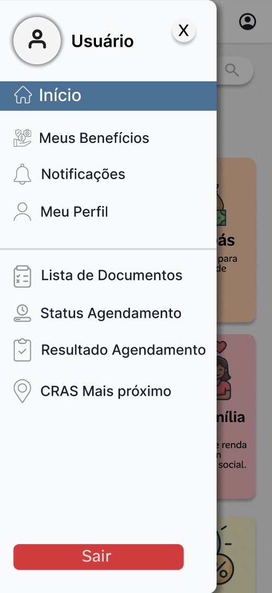</td>
</tr>
<tr>
<td align="center">Painel do Visitante</td>
<td align="center">Parte Inferior do Painel</td>
<td align="center">Menu Lateral</td>
</tr>
</tbody>
</table>

## **Objetivo**

É o ponto de entrada ao sistema, apresenta informações básicas e de fácil acesso para o usuário leitor que apenas busca se informar sem se cadastrar com o sistema. Na parte superior, encontra-se opções sobre o perfil, menu lateral e pesquisa de benefícios. O Dashboard é apresentado em forma de cards, com uma breve descrição do benefício, uma imagem ilustrativa e um botão para mais informações. O menu lateral mostra opções sobre os benefícios, agendamentos, documentos, agências, notificações e o perfil do usuário. Todo o conjunto traz as informações de forma intuitiva e de fácil entendimento.

---

### **Princípios Gestálticos**

- Proximidade: As opções de Menu e Pesquisa encontram-se agrupados na parte superior esquerda da tela, além dos benefícios e notícias agrupadas ao centro da tela.

- Semelhança: Os benefícios e suas informações encontram-se em cards semelhantes, facilitando o reconhecimento dos elementos interativos.

- Continuidade: A organização simples e agrupada dos elementos o torna auto-didático e de fácil compreensão.

- Figura-fundo: O fundo em tom mais escuro contrasta com os cards em tons claros, os mantendo destacados para os usuários.

- Fechamento: O contorno dos cards gera a fácil compreensão do seu fim, e consequentemente, do início de outro card, separando as informações e facilitando o uso.

---

### **Regras de Ouro**

- Consistência: Os campos mantém uma padronização de texto, imagem e formato, facilitando a compreensão de cada elemento.

- Feedback: O botão "Saiba Mais" expressa uma ação clara, encaminhando o usuário direto ao benefício selecionado.

- Reconhecimento em vez de memorização: O uso de títulos claro ( "Auxílio Gás", "Bolsa Família", "BPC", "TSEE" ) instrui o usuário o conteúdo do card, sem a necessidade de memorização.

- Controle do usuário: O usuário pode navegar livremente entre os cards sem bloqueios ou direcionamentos forçados.

---

### **Recomendações Ergonômicas**

- Clareza visual: O contraste entre os cards facilita a visualização mesmo em ambientes com muita iluminação.

- Hierarquia da informação: O título ao topo dos cards é definido como prioridade ao leitor, facilitando o entendimento do card.

- Redução da carga cognitiva: O painel demonstra apenas os elementos úteis para o usuário, mantendo uma interface simples e direta.

- Acessibilidade: O tamanho dos títulos e dos botões facilita a visualização dos elementos.

- Compatibilidade com o usuário: Textos claros ( "Saiba Mais", "Ver Mais Notícias" ) se conectam melhor com o usuário, facilitando seu entendimento.

---

#### **Benefícios**

<table>
<thead>
<tr><th colspan="4" align="left"><strong>Tabela 1:</strong> Telas dos Benefícios </th></tr>
</thead>
<tbody>
<tr>
<td width="33%">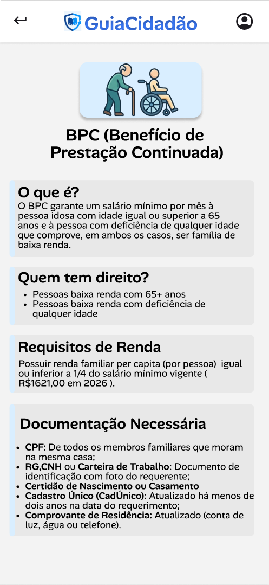</td>
<td width="33%">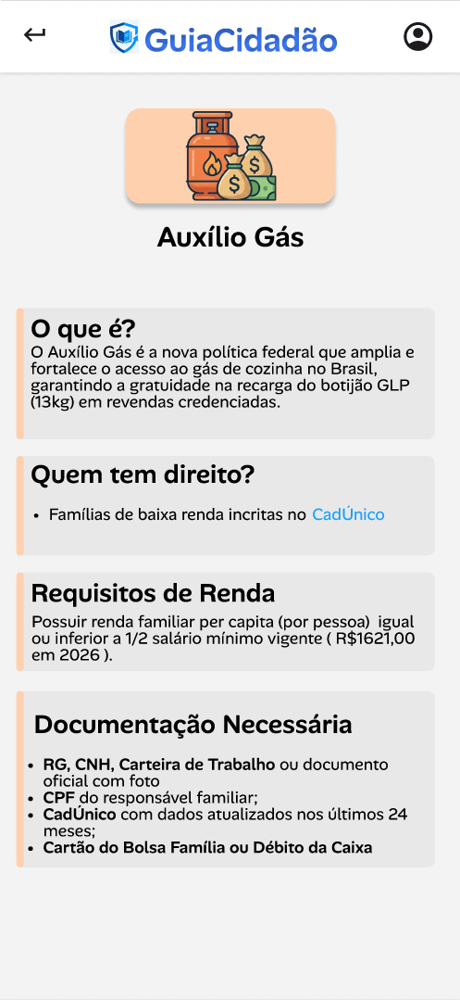</td>
<td width="33%">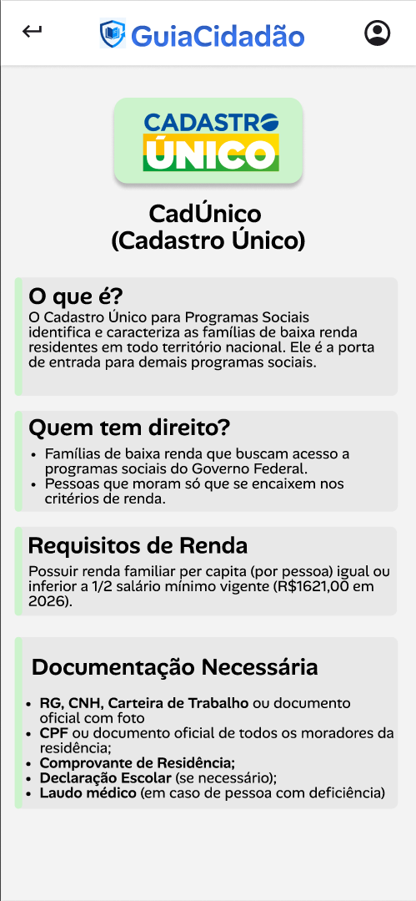</td>
</tr>
</tbody>
</table>

## **Objetivo**

O objetivo principal é agregar informações de forma compacta, resumida e bem explicada sobre cada benefício em destaque. Na parte superior, encontra-se opções para o retorno ao painel inicial e para o perfil do usuário.

---

### **Princípios Gestálticos**

- Proximidade: As opções de Retorno e Perfil encontram-se na parte superior da tela, além do logo do projeto.

- Semelhança: A informações encontram-se agrupadas em cards abaixo do título em destaque.

- Continuidade: As informações organizadas e agrupadas de forma simples facilita a compreensão.

- Figura-fundo: O fundo em tom mais claro contrasta com os cards que estão ao lado de uma cor vibrante, que conduz o usuário através de cada tópico.

- Fechamento: O contorno dos cards e a cor lateral gera fácil compreensão do seu fim, e consequentemente, do início de outro card, separando as informações e facilitando o uso.

---

### **Regras de Ouro**

- Consistência: Os campos mantém uma padronização de texto, imagem e formato, facilitando a compreensão de cada elemento.

- Feedback: Presença de informações claras através de uma linguagem direta, com frases como "O que é?","Quem tem direito?" e "Documentação Necessária".

- Reconhecimento em vez de memorização: O uso de títulos em destaque conduz o usuário entre a grande quantidade de conteúdo, sem a necessidade de memorização de cada parte.

- Controle do usuário: O usuário pode navegar livremente entre as informações sem bloqueios.

---

### **Recomendações Ergonômicas**

- Clareza visual: As cores ao início de cada tópico destaca o seu conteúdo.

- Hierarquia da informação: O título ao topo dos tópicos é tido como prioridade ao leitor, guiando-se por entre as partes.

- Redução da carga cognitiva: O painel inclui as informações agrupadas e escritas de uma forma direta, com seus respectivos títulos escritos em destaque.

- Acessibilidade: O tamanho dos títulos e do texto facilita a visualização dos elementos.

- Compatibilidade com o usuário: Textos claros ( "O que é?", "Quem tem direito?" ) se conectam melhor com o usuário, facilitando seu entendimento.

---

#### **Fluxo de Autenticação do Cidadão**

<table>
<thead>
<tr><th colspan="4" align="left"><strong>Tabela 2:</strong> Telas do fluxo de autenticação </th></tr>
</thead>
<tbody>
<tr>
<td width="33%">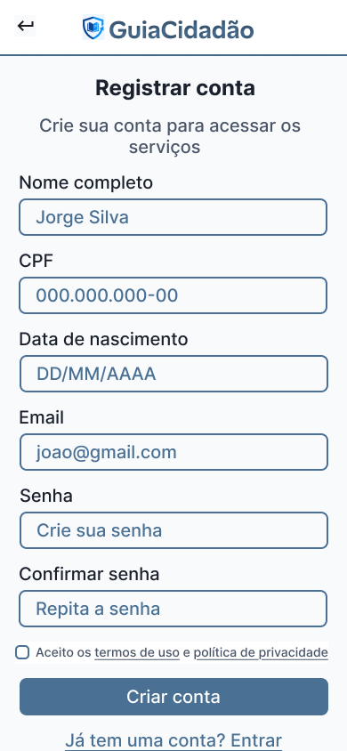</td>
<td width="33%">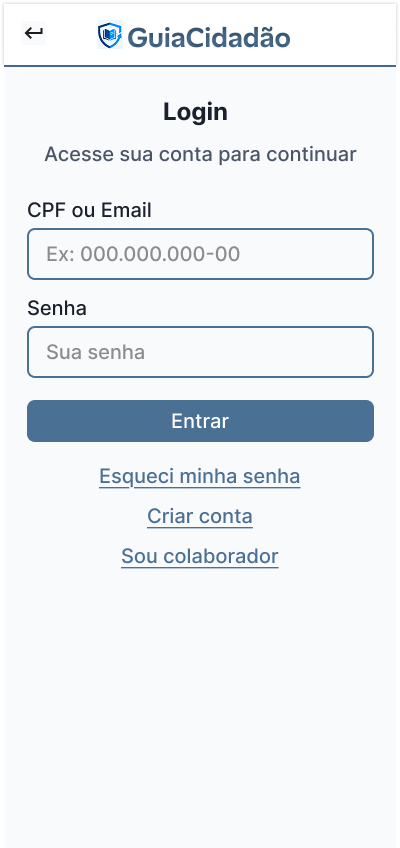</td>
<td width="33%">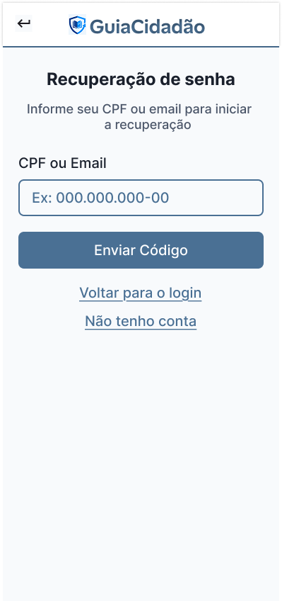</td>
</tr>
<tr>
<td align="center">Cadastro</td>
<td align="center">Login</td>
<td align="center">Recuperação de Senha</td>
</tr>
</tbody>
</table>

## **Objetivo**

As telas de Cadastro, Login e Recuperação de Senha compõem o fluxo de autenticação do cidadão no sistema GuiaCidadão. Esse fluxo permite ao usuário criar uma conta, acessar a plataforma e recuperar seu acesso de forma segura quando necessário.

A tela de Cadastro é responsável por coletar dados essenciais do usuário, como nome, CPF, data de nascimento, e credenciais de acesso, garantindo conformidade com requisitos de identificação e segurança. A tela de Login permite a autenticação de usuários já cadastrados, sendo o principal ponto de entrada para funcionalidades protegidas do sistema. Já a tela de Recuperação de Senha possibilita a redefinição de acesso por meio do envio de um código ao canal de contato informado.

O conjunto dessas telas atende diretamente aos requisitos funcionais de cadastro e autenticação (RF01 e RF02), além de reforçar aspectos de segurança, usabilidade e acessibilidade definidos nos requisitos não funcionais do sistema.

---

### **Princípios Gestálticos**

- Proximidade: Os campos de entrada estão organizados em blocos lógicos (dados pessoais, credenciais e ações), facilitando o entendimento e preenchimento por parte do usuário.

- Semelhança: Inputs, botões e links seguem um padrão visual consistente entre as três telas, permitindo reconhecimento imediato dos elementos interativos.

- Continuidade: A navegação entre cadastro, login e recuperação de senha segue um fluxo natural e esperado pelo usuário, reduzindo dificuldades de uso.

- Figura-fundo: Os botões de ação principal em cor azul se destacam sobre o fundo claro, direcionando a atenção do usuário para as ações mais importantes.

- Fechamento: Os campos e seções possuem delimitações visuais claras, permitindo ao usuário identificar facilmente o início e fim de cada grupo de informações.

---

### **Regras de Ouro**

- Consistência: O cabeçalho, os campos de entrada e os botões seguem o mesmo padrão visual em todas as telas, garantindo uniformidade na experiência.

- Feedback: Botões com textos claros como "Criar conta", "Entrar" e "Enviar Código" comunicam diretamente a ação que será executada.

- Reconhecimento em vez de memorização: O uso de placeholders e labels (como CPF, Email e Senha) reduz a necessidade de memorização por parte do usuário.

- Prevenção de erros: Campos com máscara (CPF) e confirmação de senha ajudam a evitar erros de preenchimento, alinhando-se às boas práticas de validação de dados.

- Controle do usuário: Links como "Voltar", "Esqueci minha senha" e "Criar conta" permitem navegação livre entre as telas sem bloqueios.

---

### **Recomendações Ergonômicas**

- Clareza visual: O contraste entre fundo, textos e botões facilita a leitura e identificação dos elementos da interface.

- Hierarquia da informação: Títulos como "Login" e "Registrar conta" são destacados, orientando o foco do usuário na ação principal da tela.

- Redução da carga cognitiva: Cada tela apresenta apenas os elementos essenciais para sua função, evitando sobrecarga de informações.

- Acessibilidade: Os campos e botões possuem tamanho adequado para interação em dispositivos móveis, respeitando padrões mínimos de usabilidade.

- Compatibilidade com o usuário: A interface utiliza linguagem simples e direta, adequada ao público-alvo com diferentes níveis de letramento digital.

---

### **Perfil do Colaborador**

O Colaborador é o usuário interno responsável por manter o conteúdo da plataforma, o que inclui o catálogo de benefícios, a biblioteca de requisitos de elegibilidade, a biblioteca de documentos e o cadastro das unidades de atendimento. Como cada alteração afeta diretamente a experiência do Cidadão, o painel prioriza consistência visual, prevenção de erros e visibilidade do impacto das operações. Requisitos e documentos foram tratados como entidades reutilizáveis entre benefícios, decisão que reduz duplicação no cadastro e padroniza os checklists apresentados aos cidadãos.

A análise está organizada em dois grupos. O primeiro percorre o fluxo principal do Colaborador, da entrada no sistema até a edição de um benefício. O segundo apresenta as telas de proteção, reversão e reuso, que aparecem em momentos críticos da edição. Os demais fluxos do painel, como autenticação, perfil próprio e a gestão de Documentos, Requisitos e Unidades, seguem os mesmos padrões descritos a seguir.

#### **Fluxo central**

<table>
<thead>
<tr><th colspan="4" align="left"><strong>Tabela 3:</strong> Telas do fluxo central do Colaborador</th></tr>
</thead>
<tbody>
<tr>
<td width="25%"></td>
<td width="25%"></td>
<td width="25%"></td>
<td width="25%"></td>
</tr>
<tr>
<td align="center">Painel</td>
<td align="center">Catálogo</td>
<td align="center">Detalhes do Benefício</td>
<td align="center">Editar Benefício</td>
</tr>
</tbody>
</table>

**Objetivo**

As quatro telas representam o ciclo principal de gestão de benefícios. O Painel é a entrada após a autenticação e mostra um resumo quantitativo da plataforma e atalhos para os domínios sob responsabilidade do Colaborador. O Catálogo lista os benefícios cadastrados, com busca, filtros por status e contadores. A tela de Detalhes traz o conteúdo completo de um benefício em modo de leitura, com requisitos, documentos exigidos, link oficial, contagem de cidadãos elegíveis e data da última atualização. A tela de Edição permite alterar todos os atributos do benefício, com chips reutilizáveis para requisitos e documentos.

**Princípios Gestálticos**

- Proximidade: elementos relacionados aparecem agrupados. No Painel, as quatro métricas formam um bloco e os quatro atalhos formam outro. No Catálogo, busca e botão de adição compartilham o mesmo eixo horizontal. Na Edição, os campos são distribuídos em seções de identificação, descrição, requisitos, documentos e link oficial, separadas por linhas divisórias.
- Semelhança: cards de métrica, atalhos do menu, itens das listas e chips repetem forma e tratamento visual dentro de cada categoria, o que torna os elementos interativos imediatamente reconhecíveis.
- Continuidade: a leitura de cima para baixo acompanha a sequência natural de uso, e a ordem das telas espelha a ordem das ações.
- Figura e fundo: o cabeçalho colorido contrasta com o corpo neutro e mantém o título e o contexto em destaque. Na Edição, o badge "Editando: Bolsa Família" funciona como ponto de referência permanente.
- Fechamento: cartões com cantos arredondados, linhas divisórias e chips formam unidades visuais autônomas que separam blocos de conteúdo.

**Regras de Ouro**

- Consistência: cabeçalho, navegação inferior, padrão de busca com filtros, layout dos formulários e disposição dos botões se repetem em todas as telas autenticadas.
- Atalhos para usuários frequentes: a busca no Catálogo evita rolagem extensa, e o link "Editar" no canto da tela de Detalhes leva direto à edição.
- Feedback informativo: contadores nos filtros do Catálogo, contagem de cidadãos elegíveis e data da última atualização na tela de Detalhes, chips visíveis dos requisitos e documentos vinculados na Edição.
- Prevenção de erros: campos obrigatórios marcados com asterisco e legenda no topo dos formulários. A tela de Detalhes funciona como etapa de consulta antes da edição.
- Reversão de ações: o botão "Cancelar" acompanha "Salvar" na Edição, e os chips podem ser removidos pelo "×" e readicionados pelo "+ Adicionar".
- Senso de controle: o Colaborador escolhe o domínio no Painel, alterna entre filtros no Catálogo e decide entre apenas consultar ou editar.
- Redução da carga de memória de curto prazo: as métricas do Painel deixam visíveis as quantidades de cada categoria, e a tela de Detalhes mostra o conteúdo completo do benefício antes da edição.

**Recomendações Ergonômicas**

- Áreas de toque: itens de lista, atalhos e cartões com altura mínima de 60px; campos de formulário entre 44px e 65px; chips com 30px. Todos atendem o mínimo recomendado de 44px para mobile.
- Hierarquia da informação: títulos contextuais ("Olá, Maria!", "Todos os benefícios", "Editando: Bolsa Família") orientam o foco do usuário. Tipografia maior para nomes principais, menor para metadados.
- Contraste: texto escuro sobre fundo claro garante legibilidade nos campos e listas, e o cabeçalho colorido cria contraste consistente em todas as telas autenticadas.
- Acessibilidade: tamanhos de fonte legíveis em telas a partir de 4 polegadas, atendendo ao RNF01. Rótulos sempre acima dos campos. Botões primários e secundários diferenciados por cor e proeminência.
- Compatibilidade com o usuário: linguagem direta nos textos da interface ("Veja um resumo da plataforma", "Acesso rápido", "Cadastro: 1.240 cidadãos elegíveis"), alinhada ao RNF05.

<h2></h2>

#### **Ações críticas e padrões complementares**

<table>
<thead>
<tr><th colspan="4" align="left"><strong>Tabela 4:</strong> Telas de ações críticas e padrões complementares do Colaborador</th></tr>
</thead>
<tbody>
<tr>
<td width="25%"></td>
<td width="25%"></td>
<td width="25%"></td>
<td width="25%"></td>
</tr>
<tr>
<td align="center">Confirmar Desativação</td>
<td align="center">Confirmar Reativação</td>
<td align="center">Descartar Alterações</td>
<td align="center">Adicionar Requisito</td>
</tr>
</tbody>
</table>

**Objetivo**

As quatro telas tratam de situações de risco, reuso e proteção contra perda de dados. As três primeiras são modais de confirmação que antecedem ações com impacto sobre o sistema ou sobre dados em curso: desativar um benefício, reativar um benefício previamente desativado e descartar alterações de um formulário em edição. A quarta é um bottom sheet acionado dentro da edição de benefício e permite associar requisitos já cadastrados na biblioteca ou criar um novo requisito sem sair do contexto.

**Princípios Gestálticos**

- Figura e fundo: nas três telas de confirmação, o ícone central em círculo (alerta nas desativações e descarte, check na reativação) recebe destaque sobre o fundo neutro e indica o tipo de ação. No bottom sheet, o backdrop escurecido foca a atenção no painel inferior.
- Proximidade: a "Caixa de Impacto" reúne as consequências da ação em um único container, deixando claro que descrevem o mesmo evento. No bottom sheet, as abas "Da biblioteca" e "Criar novo" ficam lado a lado e indicam alternativas para a mesma intenção.
- Semelhança: as três telas de confirmação compartilham a mesma estrutura: ícone, título, caixa de impacto, texto de reversibilidade e dois botões. Os itens do bottom sheet seguem o mesmo formato dos itens da Biblioteca de Requisitos.
- Continuidade: a leitura de cima para baixo nas telas de confirmação acompanha a progressão alerta, pergunta, impacto, reversibilidade e ação.
- Fechamento: cada Caixa de Impacto e o cartão do bottom sheet têm cantos arredondados que separam essas regiões do restante da tela.

**Regras de Ouro**

- Prevenção de erros: as três telas de confirmação interrompem ações de alto impacto e exigem um passo intermediário antes da execução. A tela de Descartar Alterações protege contra perda acidental de dados em formulários.
- Feedback informativo: cada Caixa de Impacto detalha as consequências em linguagem direta, com frases como "1.240 cidadãos afetados", "8 benefícios serão reavaliados", "Cidadãos elegíveis serão notificados" e "Campos preenchidos do formulário".
- Reversão de ações: textos como "Você poderá reativar a qualquer momento pelo Painel" e "Você poderá desativar novamente a qualquer momento" reduzem o medo de errar. A tela de Reativação demonstra na prática que a desativação não é permanente.
- Diálogos que indicam fim de ação: dois botões claros em cada confirmação ("Cancelar" e "Confirmar", "Desativar" ou "Reativar") encerram o fluxo de forma inequívoca.
- Senso de controle: no bottom sheet, o usuário escolhe entre reusar um requisito existente ou criar um novo sem sair da edição. Backdrop clicável e botão de fechar (×) oferecem saída imediata, e a busca interna acelera a localização.
- Redução da carga de memória de curto prazo: a aba "Da biblioteca" lista os requisitos disponíveis com checkboxes e seleção múltipla, e o usuário não precisa lembrar nomes ou parâmetros exatos.
- Consistência: o padrão "Caixa de Impacto, texto de reversibilidade, dois botões" se repete em todas as confirmações de desativação dos quatro domínios e na tela de Reativação. O bottom sheet é replicado para "Adicionar Documento" com a mesma estrutura.

**Recomendações Ergonômicas**

- Posicionamento: o bottom sheet ocupa a parte inferior da tela, dentro do alcance do polegar em uso de uma só mão. Os modais de confirmação são centralizados verticalmente, com o ícone como ponto focal.
- Áreas de toque: botões com altura entre 48px e 52px nos modais; checkboxes do bottom sheet com 20px e área expandida; drag handle e ícone de fechar (×) com 32px.
- Hierarquia visual: pergunta principal em fonte grande nas confirmações ("Desativar Bolsa Família?", "Reativar Vale-Gás Nacional?", "Tem certeza?"), com detalhes em fonte menor.
- Distinção entre ações: botão primário à direita, botão secundário ("Cancelar") à esquerda, com separação horizontal suficiente. Cores diferenciam ações construtivas (reativação) de destrutivas (desativação e descarte).
- Linguagem simples: os textos evitam jargão técnico ("O que muda", "O que será perdido", "Você poderá reativar"), atendendo ao RNF05.

---

#### **Fluxo de Agendamento e Gestão**

<table>
<thead>
<tr><th colspan="4" align="left"><strong>Tabela 5:</strong> Telas do fluxo de Agendamento e Gestão </th></tr>
</thead>
<tbody>
<tr>
<td width="33%">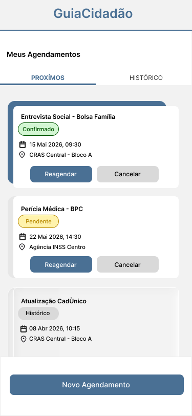</td>
<td width="33%">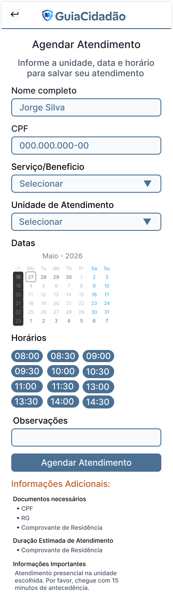</td>
<td width="33%">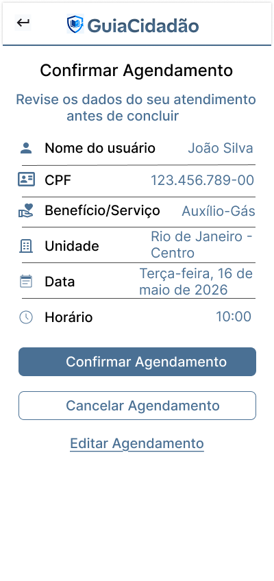</td>
</tr>
<tr>
<td align="center">Meus Agendamentos</td>
<td align="center">Agendamento</td>
<td align="center">Confirmar Agendamento</td>
</tr>
</tbody>
</table>

## **Objetivo**

As três telas representam o ciclo de vida do agendamento sob a perspectiva do Cidadão. A tela Meus Agendamentos funciona como o centro de controle, organizando os compromissos em abas de "Próximos" e "Histórico", com status claros (Confirmado, Pendente). A tela de Agendamento é o formulário de entrada, onde o usuário seleciona o serviço, unidade, data e horário. Por fim, a tela de Confirmar Atendimento atua como uma camada de segurança, apresentando um resumo detalhado para conferência antes da geração do protocolo definitivo.

---

### **Princípios Gestálticos**

- Proximidade: Informações correlatas são agrupadas em cards. Em "Meus Agendamentos", o ícone de calendário, a data e o local formam um bloco coeso. No formulário, rótulos e campos de entrada estão estritamente próximos para evitar confusão.

- Semelhança: Os botões de ação ("Reagendar", "Cancelar", "Novo Agendamento") mantêm padrões cromáticos e de arredondamento, permitindo que o usuário identifique rapidamente o que é uma ação primária ou secundária.

- Continuidade: O fluxo segue uma lógica linear e vertical. No formulário de agendamento, a sequência (Quem -> O quê -> Onde -> Quando) respeita a ordem mental de planejamento do cidadão.

- Figura-fundo: O uso de sombras leves nos cards sobre o fundo cinza claro destaca o conteúdo principal, criando uma hierarquia visual que separa a interface do plano de fundo.

- Fechamento: O uso de bordas arredondadas e divisórias sutis delimita as seções de "Informações Importantes", criando unidades de leitura autônomas que não sobrecarregam a visão.

---

### **Regras de Ouro**

- Consistência: O cabeçalho com a marca "GuiaCidadão" e a identidade visual azul permanecem constantes, reforçando a confiança institucional.

- Feedback: O uso de badges coloridos (verde para "Confirmado", amarelo para "Pendente") oferece resposta imediata sobre o status do serviço sem necessidade de leitura profunda.

- Reconhecimento em vez de memorização: O uso de placeholders e labels (como CPF, Email e Senha) reduz a necessidade de memorização por parte do usuário.

- Prevenção de erros: A tela de confirmação é a principal barreira contra erros, forçando o usuário a revisar CPF, Benefício e Local antes de gerar o protocolo.

- Reversão de ações: Todas as telas oferecem caminhos de volta: o botão "Cancelar Agendamento" ou "Editar" na confirmação, e a opção "Reagendar" na listagem inicial.

- Redução de carga de memória: A seção "Documentos para levar" aparece tanto no agendamento quanto na confirmação, garantindo que o usuário não precise memorizar os requisitos em telas anteriores.

---

### **Recomendações Ergonômicas**

- Áreas de toque: Os slots de horário na tela de agendamento e os botões de ação possuem dimensões generosas, facilitando o clique em dispositivos móveis e evitando toques acidentais em opções vizinhas.

- Hierarquia da informação: O uso de negrito em campos-chave (Protocolo, Nome, Benefício) destaca o que é essencial. Na tela de listagem, o nome do serviço é o elemento de maior peso visual.

- Contraste: A combinação de azul marinho para ações principais e tons de cinza para textos secundários garante excelente legibilidade, cumprindo requisitos de acessibilidade visual.

- Acessibilidade: Os campos e botões possuem tamanho adequado para interação em dispositivos móveis, respeitando padrões mínimos de usabilidade.

- Compatibilidade com o usuário: Utilização de termos simples e diretos ("Meus Agendamentos", "Novo Agendamento", "Editar"), evitando termos técnicos ou burocráticos excessivos para garantir a inclusão de todos os perfis de cidadãos.
---

#### **Gestão do Perfil e Composição Familiar**

<table>
<thead>
<tr><th colspan="5" align="left"><strong>Tabela 6:</strong> Telas de gestão de perfil e composição familiar </th></tr>
</thead>
<tbody>
<tr>
<td width="20%">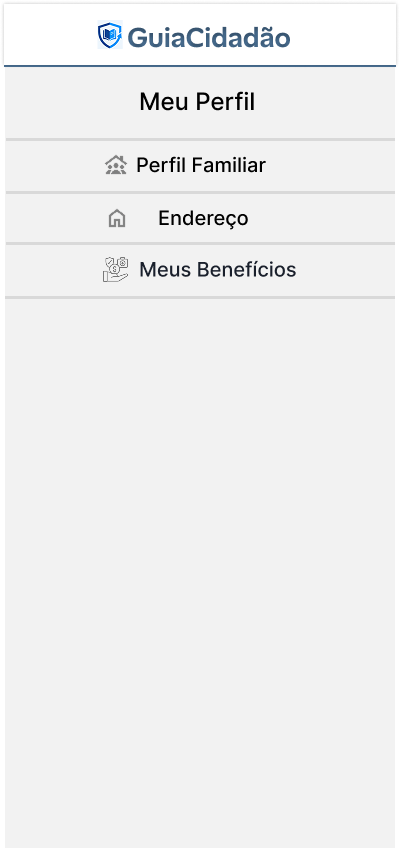</td>
<td width="20%">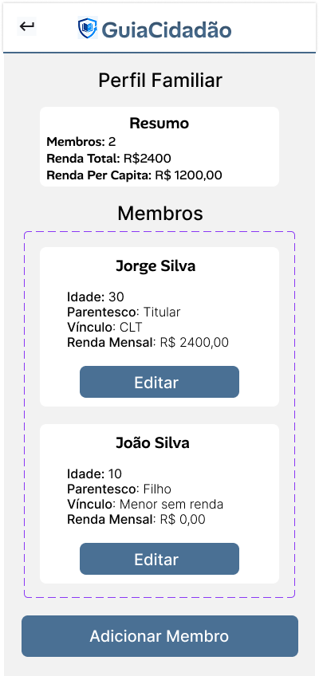</td>
<td width="20%">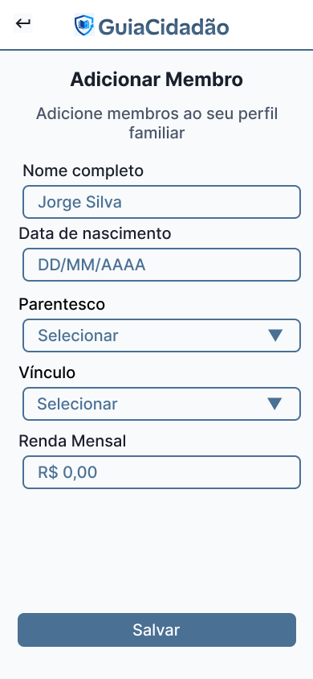</td>
<td width="20%">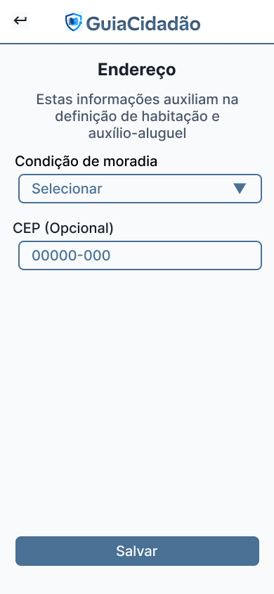</td>
<td width="20%">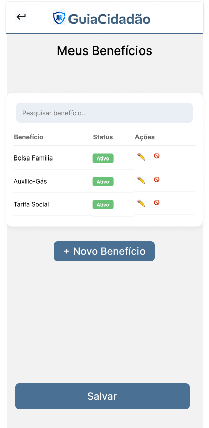</td>
</tr>
<tr>
<td align="center">Meu Perfil</td>
<td align="center">Perfil Familiar</td>
<td align="center">Adicionar Membro</td>
<td align="center">Endereço</td>
<td align="center">Meus Benefícios</td>
</tr>
</tbody>
</table>

## **Objetivo**

Este conjunto de telas permite ao cidadão gerenciar suas informações pessoais e a composição de seu núcleo familiar, dados que são fundamentais para o cálculo de elegibilidade a benefícios sociais. 

A tela "Meu Perfil" centraliza o acesso às configurações de dados. O "Perfil Familiar" oferece uma visão consolidada da renda do grupo, apresentando o cálculo automático da renda per capita e a listagem de membros. A tela "Adicionar Membro" possibilita a expansão do grupo familiar com coleta de dados socioeconômicos específicos, enquanto a tela "Endereço" foca na situação habitacional, essencial para auxílios de moradia. Todo o fluxo visa manter o cadastro do usuário atualizado para que o sistema possa sugerir benefícios de forma assertiva. A tela "Meus Benefícios" complementa esse fluxo ao oferecer ao cidadão uma visão consolidada dos benefícios vinculados ao seu perfil, com ações rápidas de edição e cancelamento, reforçando a autonomia no acompanhamento da sua situação social.

---

### **Princípios Gestálticos**

- **Proximidade:** Na tela de Perfil Familiar, os dados de "Resumo" (membros, renda total e per capita) estão agrupados em um card branco, indicando que pertencem à mesma métrica de análise. Da mesma forma, os campos do formulário de Adição de Membro estão próximos uns dos outros para formar uma unidade de preenchimento.

- **Semelhança:** Os cards que representam cada membro da família (Jorge Silva e João Silva) possuem o mesmo tratamento visual, ícones e botões "Editar", permitindo que o usuário entenda que possuem a mesma função e importância.

- **Figura-fundo:** O uso de um fundo cinza claro contrasta com os cards brancos e botões azuis, destacando os elementos de interação e as informações principais sobre o plano de fundo neutro.

- **Fechamento:** O uso de bordas arredondadas e o contorno pontilhado na seção de membros criam uma área delimitada que ajuda o usuário a perceber onde começa e termina a lista de dependentes.

- **Continuidade:** A disposição vertical dos itens no menu "Meu Perfil" e nos formulários guia o olhar do usuário de cima para baixo em uma sequência lógica de leitura e ação.

---

### **Regras de Ouro**

- **Consistência:** Os botões "Salvar", "Adicionar Membro" e "Editar" mantêm o padrão de cor azul e cantos arredondados utilizado em todo o sistema, garantindo uma identidade visual uniforme.

- **Redução da carga de memória de curto prazo:** O sistema realiza e exibe o cálculo da "Renda Per Capita" automaticamente na tela de Perfil Familiar, poupando o usuário de realizar cálculos matemáticos para entender sua situação.

- **Feedback informativo:** Ao entrar na edição de endereço ou membros, os campos apresentam placeholders e máscaras (como no CEP e Renda Mensal) que orientam o preenchimento correto em tempo real.

- **Controle do usuário:** A presença constante do botão de "Voltar" (seta no topo esquerdo) e do botão "Editar" permite que o usuário corrija informações ou cancele ações de forma simples e direta.

- **Reconhecimento em vez de memorização:** As etiquetas (labels) acima de cada campo de entrada (Nome, Data de Nascimento, Parentesco) garantem que o usuário saiba exatamente o que deve preencher sem precisar recordar instruções de telas anteriores.

---

### **Recomendações Ergonômicas**

- **Clareza visual:** O uso de negrito para destacar valores (R$ 2.400,00) e nomes de membros facilita a varredura visual rápida da tela, permitindo encontrar informações importantes em poucos segundos.

- **Áreas de toque:** Os botões de ação e os itens de menu possuem altura suficiente para serem acionados facilmente por dedos de diferentes tamanhos em dispositivos móveis, evitando cliques acidentais em campos vizinhos.

- **Hierarquia da informação:** O título da página é o elemento de maior destaque no topo, seguido por subtítulos de seção ("Resumo", "Membros"), organizando o conteúdo de forma que o usuário entenda a prioridade dos dados.

- **Acessibilidade:** O alto contraste entre o texto escuro e o fundo claro, juntamente com o uso de ícones intuitivos (casa para endereço, pessoas para perfil familiar), auxilia na compreensão por usuários com diferentes níveis de literacia digital.

- **Compatibilidade com o usuário:** O uso de termos familiares como "Vínculo" e "Parentesco", além da máscara de moeda (R$), torna a interface amigável e próxima do vocabulário cotidiano do cidadão brasileiro.

## 4.4 Testes com Protótipos

Nesta seção serão apresentados os resultados dos testes realizados com os protótipos de alta fidelidade do sistema GuiaCidadão, conduzidos com 6 candidatos a usuários do sistema. O objetivo principal foi avaliar a clareza das informações, a facilidade de navegação, a compreensão das funcionalidades e a acessibilidade do sistema para usuários com baixa familiaridade tecnológica e dificuldades relacionadas à burocracia e linguagem técnica.

Primeiramente, será apresentada a metodologia utilizada pelo grupo durante os testes. Em seguida, serão sintetizados os comentários, opiniões e observações fornecidos pelos participantes, contribuindo para os próximos ciclos de melhoria do sistema.

---

### Metodologia
#### Perguntas

Foram escolhidas oito perguntas para serem direcionadas aos usuários, com o intuito de captar e analisar suas impressões sobre o sistema:

<ol>
  <li>Ao analisar a página inicial, você conseguiu entender rapidamente qual é o propósito principal do aplicativo?</li>
  <li>Os menus e botões estavam posicionados de forma clara e fácil de encontrar?</li>
  <li>As etapas para realizar tarefas, como cadastro, busca de benefícios e agendamento, estavam claras e seguiam uma lógica compreensível?</li>
  <li>Os elementos visuais (cores, ícones e disposição dos botões) ajudaram a identificar o que era clicável e o que era apenas informativo?</li>
  <li>Houve alguma informação, botão ou funcionalidade que gerou confusão?</li>
  <li>Você sentiu que conseguiria utilizar o aplicativo sem ajuda de terceiros?</li>
  <li>Classifique sua experiência com uma nota entre 1 e 5.</li>
  <li>Comente os fatores que o levaram a essa nota.</li>
</ol>

---

### Passo a passo

De posse dessas perguntas, foi definido um conjunto de cinco passos para a realização dos testes, com a finalidade de tornar o processo menos cansativo e mais eficiente para os participantes. As telas foram divididas em grupos relacionados às funcionalidades do sistema, reduzindo o esforço cognitivo dos usuários e facilitando a compreensão do fluxo de navegação.

Os cinco passos efetuados foram:

#### Passo 1

Foram apresentadas as telas de login, cadastro e recuperação de senha. Após a visualização dessas telas, os usuários responderam à pergunta 1, relacionada à compreensão inicial do propósito do sistema.

#### Passo 2

Foram apresentadas as telas da página inicial, menu lateral e notificações. Após a visualização, os usuários responderam às perguntas 2 a 5, relacionadas à navegação, organização das funcionalidades e clareza visual.

#### Passo 3

Foram apresentadas as telas informativas dos benefícios sociais, incluindo BPC, Bolsa Família, Auxílio Gás, CadÚnico, TSEE e Auxílio Acidente. Após a visualização, os usuários responderam novamente às perguntas 2 a 5.

#### Passo 4

Foram apresentadas as telas do checklist de documentos, localizador de CRAS e fluxo de agendamento de atendimento, incluindo confirmação e gerenciamento de agendamentos. Após a visualização, os usuários responderam mais uma vez às perguntas 2 a 5.

#### Passo 5

Após a apresentação de todas as telas selecionadas para o teste, os usuários responderam às perguntas 6 a 8, apresentando suas conclusões gerais sobre o sistema.

---

### Síntese dos resultados
#### Pontos positivos

Houve convergência entre os participantes em relação a diversos pontos positivos do sistema:

- A organização geral das telas foi considerada clara e intuitiva.
- Os ícones e botões ajudaram significativamente na identificação das funcionalidades do aplicativo.
- A separação dos benefícios em categorias específicas facilitou a busca por informações.
- Os participantes relataram que a linguagem utilizada aparentava ser mais simples e acessível do que a normalmente encontrada em sistemas governamentais.
- O fluxo de tarefas, principalmente nos processos de cadastro, consulta de benefícios e agendamento, foi considerado fácil de acompanhar.
- A funcionalidade de checklist de documentos foi bastante elogiada, pois auxilia o usuário a entender quais documentos já possui e quais ainda precisa providenciar.
- O localizador de CRAS foi apontado como uma funcionalidade importante e útil para usuários que possuem dificuldade em encontrar unidades de atendimento.
- Todos os participantes afirmaram que conseguiriam utilizar o sistema sem ajuda externa após um curto período de adaptação.
- A média das avaliações atribuídas pelos participantes foi de 4,7 em 5.

---

### Pontos de atenção

Durante os testes, também foram identificados pontos de atenção e sugestões de melhoria:

- Alguns participantes demonstraram dúvidas sobre determinados termos técnicos utilizados nas telas, especialmente expressões relacionadas à renda familiar e critérios de elegibilidade.
- O termo “colaborador”, presente na tela de login, gerou confusão em alguns usuários, que não compreenderam imediatamente seu significado.
- Alguns usuários relataram dificuldade para entender funcionalidades relacionadas à exportação em PDF, sugerindo a utilização de termos mais simples, como “Salvar lista”.
- Houve participantes que demonstraram dificuldade ao utilizar o calendário na tela de agendamento, principalmente em dispositivos móveis.
- Alguns usuários relataram que o menu lateral poderia ser mais evidente, pois o ícone de abertura do menu não foi imediatamente identificado por todos.
- Certos textos informativos foram considerados longos, o que pode dificultar a leitura para usuários com baixa escolaridade ou pouca familiaridade com leitura digital.
- Alguns participantes sugeriram aumentar o tamanho das fontes e destacar ainda mais os botões principais de ação.
- Usuários também sugeriram adicionar uma opção de “Usar minha localização” no localizador de CRAS, facilitando a busca para pessoas que não sabem informar o CEP corretamente.
- Foi observado que algumas palavras utilizadas nos benefícios sociais poderiam ser substituídas por termos mais simples e populares, tornando o sistema ainda mais acessível.

---

### Próximos passos

Os testes realizados com os protótipos de alta fidelidade demonstraram que o GuiaCidadão possui uma proposta acessível e alinhada às necessidades do público-alvo. O retorno fornecido pelos candidatos a usuários foi essencial para identificar melhorias relacionadas à clareza das informações, simplificação da linguagem e aprimoramento da navegação.

Com base nas observações coletadas, a equipe pretende revisar elementos visuais, simplificar termos técnicos, melhorar a acessibilidade em dispositivos móveis e tornar algumas funcionalidades mais intuitivas nos próximos ciclos de desenvolvimento. Essas melhorias têm como objetivo aumentar ainda mais a autonomia dos usuários no acesso às informações e serviços relacionados aos benefícios sociais.
