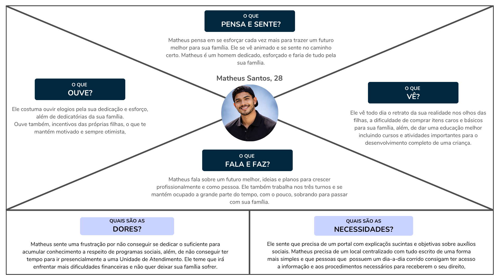

# 4. PROJETO DO DESIGN DE INTERAÇÃO

## 4.1 Personas
Nesta seção você deve detalhar as personas do seu projeto. Deve-se documentar uma persona por integrante do projeto. Para mais informações sobre personas consulte: https://www.rdstation.com/blog/marketing/persona-o-que-e/. Sugere-se a utilização de um template do Canva: https://www.canva.com/pt_br/modelos/s/persona/

### 4.1.1 João

### 4.1.2 Matheus

### 4.1.3 Ana

## 4.2 Mapa de Empatia
Mapa da Empatia é um material utilizado para conhecer melhor o seu cliente. A partir do mapa da empatia é possível detalhar a personalidade do cliente e compreendê-la melhor. O objetivo é obter um nível mais profundo de compreensão de uma persona. A seguir um exemplo de template que pode ser usado para o mapa de empatia. Para cada persona deverá ser apresentado o seu respectivo mapa de empatia. Sugere-se a utilização do template apresentado em https://www.rdstation.com/blog/marketing/mapa-da-empatia/.

### 4.2.1 João

### 4.2.2 Matheus

### 4.2.3 Ana

## 4.3 Protótipos das Interfaces

## Objetivo da Tela
É o ponto de entrada ao sistema, apresenta informações básicas e de fácil acesso para o usuário leitor que apenas busca se informar sem se cadastrar com o sistema. Também inclui portas para um menu lateral que trará mais opções para os usuários que desejam se cadastrar e utilizar das funcionalidades do sistema.

### Princípios Gestálticos
Proximidade: As opções de Menu e Pesquisa encontram-se agrupados na parte superior esquerda da tela, além dos benefícios e notícias agrupadas ao centro da tela.

Semelhança: Os benefícios e suas informações encontram-se em cards semelhantes, facilitando o reconhecimento dos elementos interativos.

Continuidade: A organização simples e agrupada dos elementos o torna auto-didático e de fácil compreensão.

Figura-fundo: O fundo em tom mais escuro contrasta com os cards em tons claros, os mantendo destacados para os usuários.

Fechamento: O contorno dos cards gera a fácil compreensão do seu fim, e consequentemente, do início de outro card, separando as informações e facilitando o uso.

### Regras de Ouro
Consistência: Os campos mantém uma padronização de texto, imagem e formato, facilitando a compreensão de cada elemento.

Feedback: O botão "Saiba Mais" expressa uma ação clara, encaminhando o usuário direto ao benefício selecionado.

Reconhecimento em vez de memorização: O uso de títulos claro ( "Auxílio Gás", "Bolsa Família", "BPC", "TSEE" ) instrui o usuário o conteúdo do card, sem a necessidade de memorização.

Controle do usuário: O usuário pode navegar livremente entre os cards sem bloqueios ou direcionamentos forçados.

### Recomendações Ergonômicas
Clareza visual: O contraste entre os cards facilita a visualização mesmo em ambientes com muita iluminação.

Hierarquia da informação: O título ao topo dos cards é definido como prioridade ao leitor, facilitando o entendimento do card.

Redução da carga cognitiva: O painel demonstra apenas os elementos úteis para o usuário, mantendo uma interface simples e direta.

Acessibilidade: O tamanho dos títulos e dos botões facilita a visualização dos elementos.

Compatibilidade com o usuário: Textos claros ( "Saiba Mais", "Ver Mais Notícias" ) se conectam melhor com o usuário, facilitando seu entendimento.

## 4.4 Testes com Protótipos
Nesta seção você deve apresentar os testes realizados com usuários utilizando os protótipos de alta fidelidade desenvolvidos na seção anterior. O objetivo é avaliar a usabilidade, a clareza das informações e a adequação do design às necessidades das personas definidas no projeto.

Cada integrante do grupo deverá aplicar o teste com um usuário distinto, preferencialmente alinhado ao perfil das personas criadas. Devem ser definidas previamente as tarefas que o usuário deverá executar no protótipo (por exemplo: realizar um cadastro, buscar um produto, concluir uma compra).

Durante a aplicação do teste, registre observações sobre comportamentos, dúvidas, erros e comentários feitos pelo usuário, bem como o tempo necessário para a execução de cada tarefa. Ao final, colete o feedback do participante, destacando pontos positivos e aspectos a serem melhorados.

Os resultados obtidos por todos os integrantes devem ser consolidados, apresentando uma análise geral com os principais problemas encontrados, oportunidades de melhoria e as ações previstas para o projeto final. 
