# **4. PROJETO DO DESIGN DE INTERAÇÃO**

## **4.1 Personas**

Nesta seção você deve detalhar as personas do seu projeto. Deve-se documentar uma persona por integrante do projeto. Para mais informações sobre personas consulte: [RDStation, o que é persona](https://www.rdstation.com/blog/marketing/persona-o-que-e/). Sugere-se a utilização de um template do Canva: [modelos de persona no Canva](https://www.canva.com/pt_br/modelos/s/persona/).

### 4.1.1 João

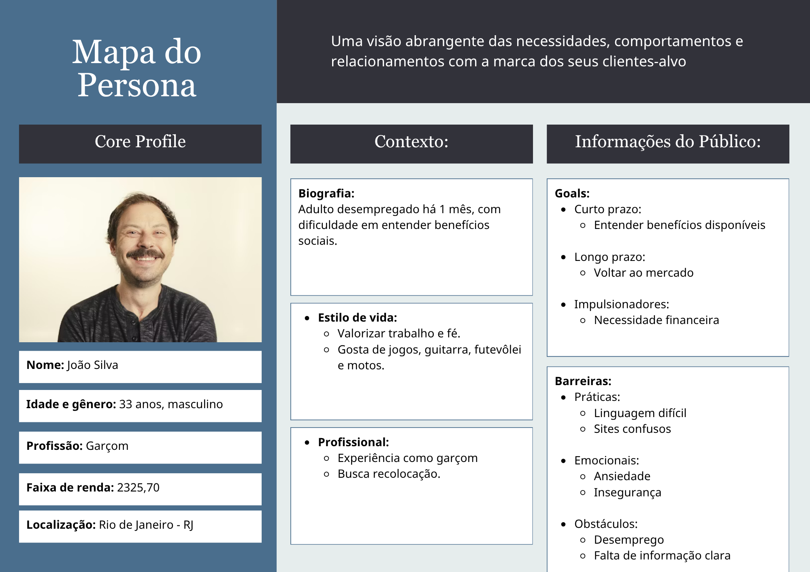

### 4.1.2 Matheus

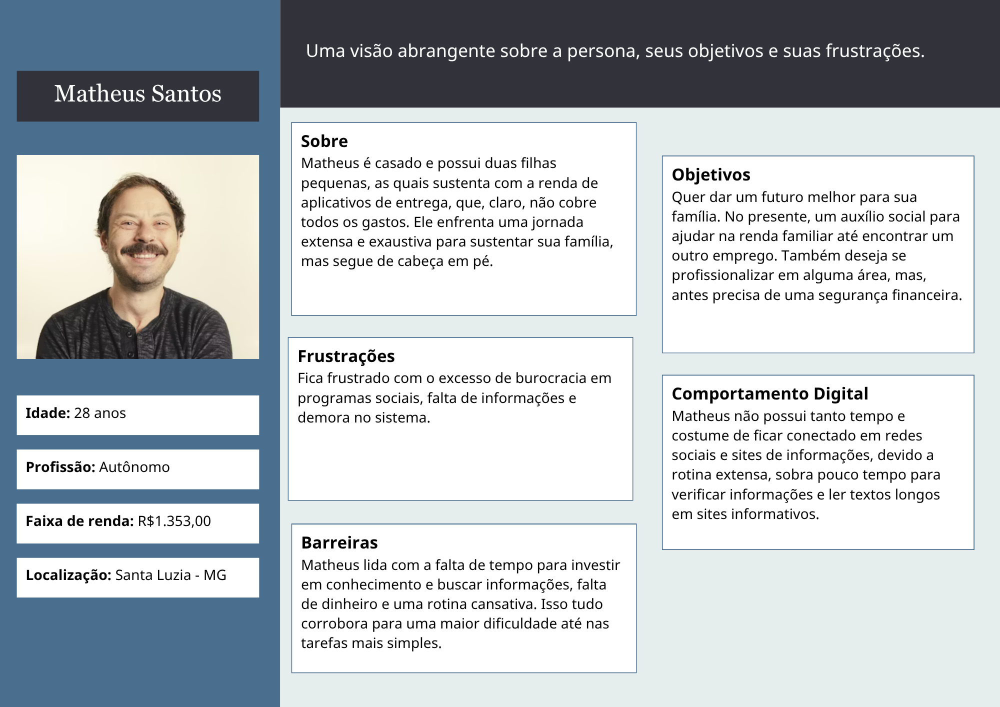

### 4.1.3 Ana

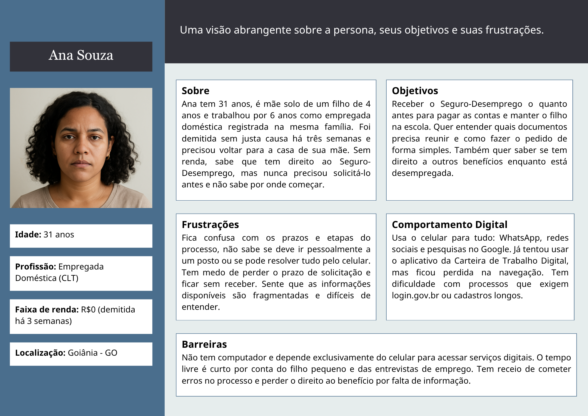

## **4.2 Mapa de Empatia**

Mapa da Empatia é um material utilizado para conhecer melhor o seu cliente. A partir do mapa da empatia é possível detalhar a personalidade do cliente e compreendê-la melhor. O objetivo é obter um nível mais profundo de compreensão de uma persona. A seguir um exemplo de template que pode ser usado para o mapa de empatia. Para cada persona deverá ser apresentado o seu respectivo mapa de empatia. Sugere-se a utilização do template apresentado em [RDStation, mapa da empatia](https://www.rdstation.com/blog/marketing/mapa-da-empatia/).

### 4.2.1 João

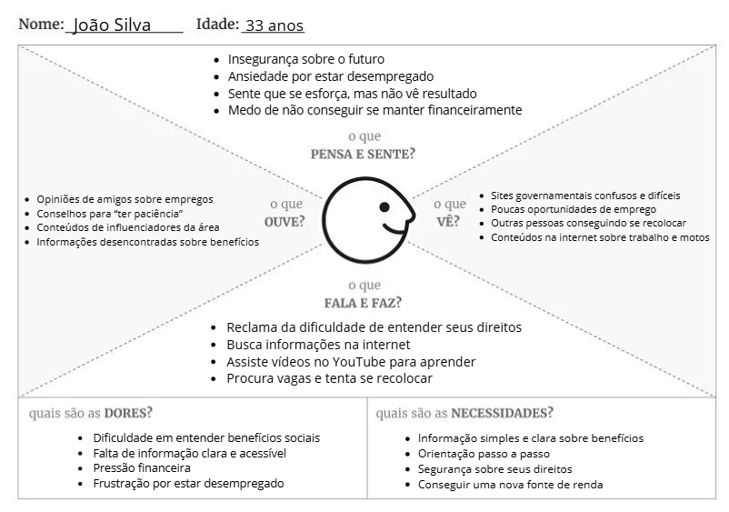

### 4.2.2 Matheus

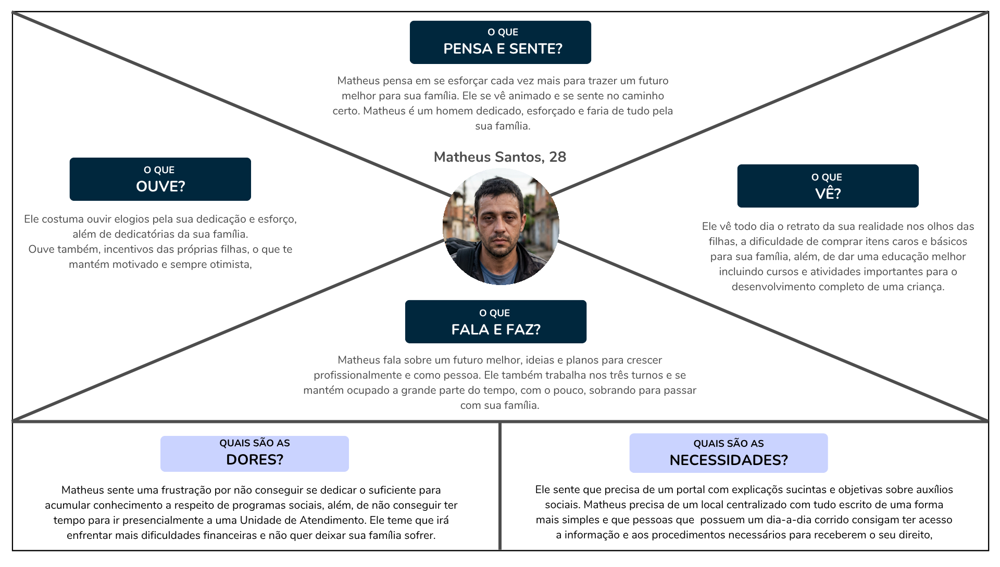

### 4.2.3 Ana

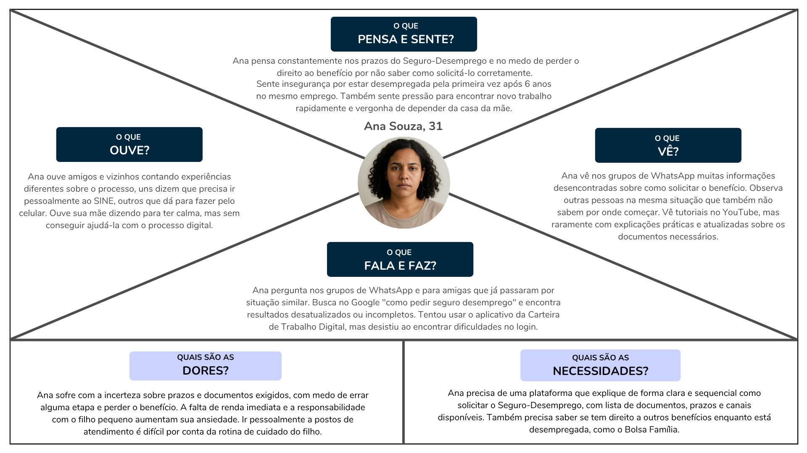

## **4.3 Protótipos das Interfaces**

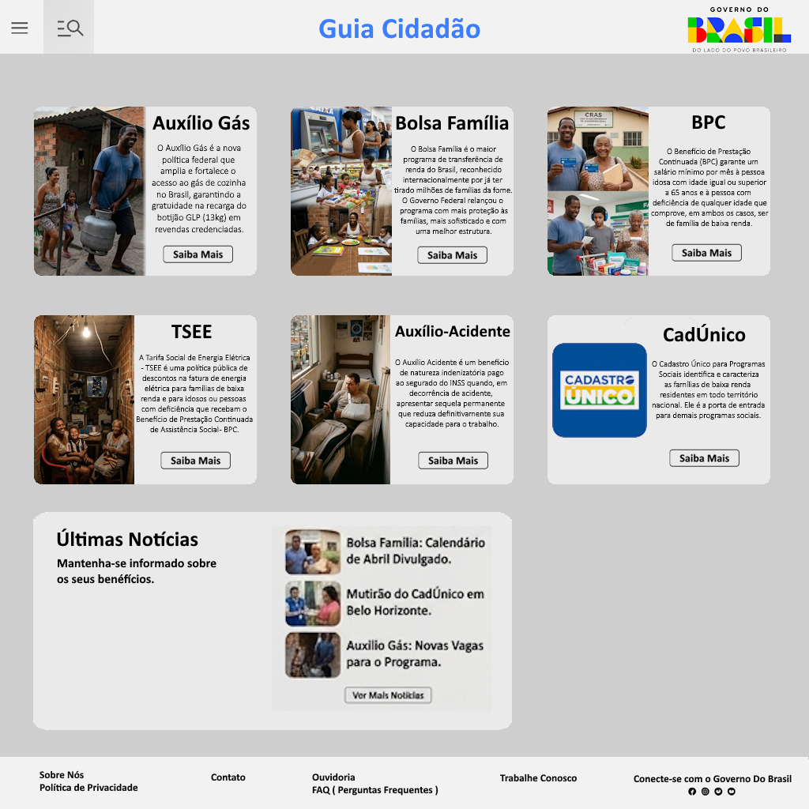

## **Objetivo da Tela**

É o ponto de entrada ao sistema, apresenta informações básicas e de fácil acesso para o usuário leitor que apenas busca se informar sem se cadastrar com o sistema. Também inclui portas para um menu lateral que trará mais opções para os usuários que desejam se cadastrar e utilizar das funcionalidades do sistema.

---

### **Princípios Gestálticos**

- Proximidade: As opções de Menu e Pesquisa encontram-se agrupados na parte superior esquerda da tela, além dos benefícios e notícias agrupadas ao centro da tela.

- Semelhança: Os benefícios e suas informações encontram-se em cards semelhantes, facilitando o reconhecimento dos elementos interativos.

- Continuidade: A organização simples e agrupada dos elementos o torna auto-didático e de fácil compreensão.

- Figura-fundo: O fundo em tom mais escuro contrasta com os cards em tons claros, os mantendo destacados para os usuários.

- Fechamento: O contorno dos cards gera a fácil compreensão do seu fim, e consequentemente, do início de outro card, separando as informações e facilitando o uso.

---

### **Regras de Ouro**

- Consistência: Os campos mantém uma padronização de texto, imagem e formato, facilitando a compreensão de cada elemento.

- Feedback: O botão "Saiba Mais" expressa uma ação clara, encaminhando o usuário direto ao benefício selecionado.

- Reconhecimento em vez de memorização: O uso de títulos claro ( "Auxílio Gás", "Bolsa Família", "BPC", "TSEE" ) instrui o usuário o conteúdo do card, sem a necessidade de memorização.

- Controle do usuário: O usuário pode navegar livremente entre os cards sem bloqueios ou direcionamentos forçados.

---

### **Recomendações Ergonômicas**

- Clareza visual: O contraste entre os cards facilita a visualização mesmo em ambientes com muita iluminação.

- Hierarquia da informação: O título ao topo dos cards é definido como prioridade ao leitor, facilitando o entendimento do card.

- Redução da carga cognitiva: O painel demonstra apenas os elementos úteis para o usuário, mantendo uma interface simples e direta.

- Acessibilidade: O tamanho dos títulos e dos botões facilita a visualização dos elementos.

- Compatibilidade com o usuário: Textos claros ( "Saiba Mais", "Ver Mais Notícias" ) se conectam melhor com o usuário, facilitando seu entendimento.

---

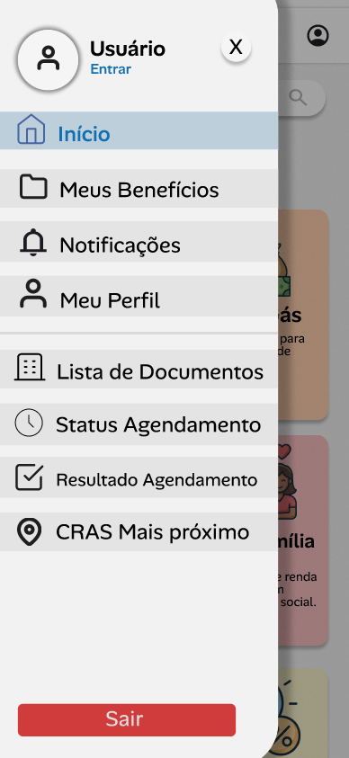

---

### **Perfil do Colaborador**

O Colaborador é o usuário interno responsável por manter o conteúdo da plataforma, o que inclui o catálogo de benefícios, a biblioteca de requisitos de elegibilidade, a biblioteca de documentos e o cadastro das unidades de atendimento. Como cada alteração afeta diretamente a experiência do Cidadão, o painel prioriza consistência visual, prevenção de erros e visibilidade do impacto das operações. Requisitos e documentos foram tratados como entidades reutilizáveis entre benefícios, decisão que reduz duplicação no cadastro e padroniza os checklists apresentados aos cidadãos.

A análise está organizada em dois grupos. O primeiro percorre o fluxo principal do Colaborador, da entrada no sistema até a edição de um benefício. O segundo apresenta as telas de proteção, reversão e reuso, que aparecem em momentos críticos da edição. Os demais fluxos do painel, como autenticação, perfil próprio e a gestão de Documentos, Requisitos e Unidades, seguem os mesmos padrões descritos a seguir.

#### **Fluxo central**

<table>
<thead>
<tr><th colspan="4" align="left"><strong>Tabela 1:</strong> Telas do fluxo central do Colaborador</th></tr>
</thead>
<tbody>
<tr>
<td width="25%">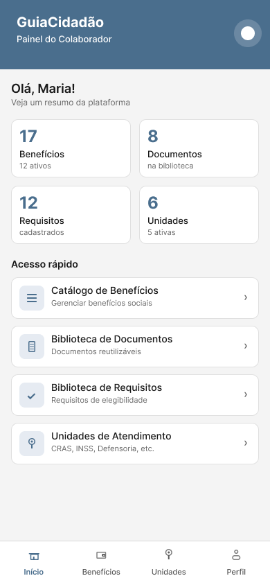</td>
<td width="25%">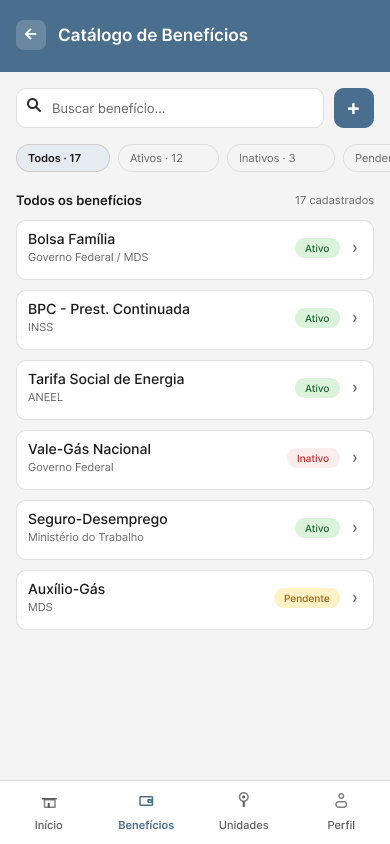</td>
<td width="25%">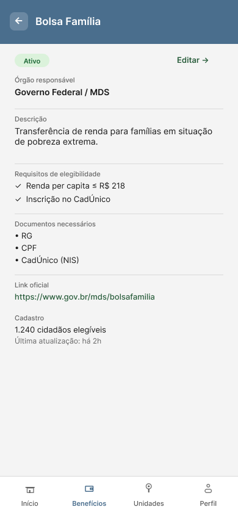</td>
<td width="25%">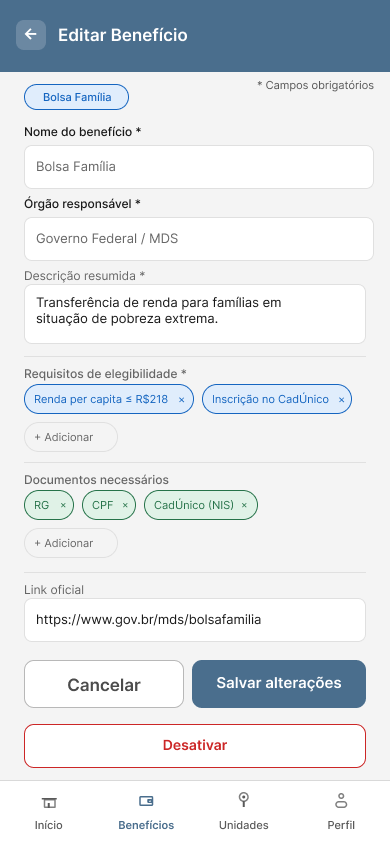</td>
</tr>
<tr>
<td align="center">Painel</td>
<td align="center">Catálogo</td>
<td align="center">Detalhes do Benefício</td>
<td align="center">Editar Benefício</td>
</tr>
</tbody>
</table>

**Objetivo**

As quatro telas representam o ciclo principal de gestão de benefícios. O Painel é a entrada após a autenticação e mostra um resumo quantitativo da plataforma e atalhos para os domínios sob responsabilidade do Colaborador. O Catálogo lista os benefícios cadastrados, com busca, filtros por status e contadores. A tela de Detalhes traz o conteúdo completo de um benefício em modo de leitura, com requisitos, documentos exigidos, link oficial, contagem de cidadãos elegíveis e data da última atualização. A tela de Edição permite alterar todos os atributos do benefício, com chips reutilizáveis para requisitos e documentos.

**Princípios Gestálticos**

- Proximidade: elementos relacionados aparecem agrupados. No Painel, as quatro métricas formam um bloco e os quatro atalhos formam outro. No Catálogo, busca e botão de adição compartilham o mesmo eixo horizontal. Na Edição, os campos são distribuídos em seções de identificação, descrição, requisitos, documentos e link oficial, separadas por linhas divisórias.
- Semelhança: cards de métrica, atalhos do menu, itens das listas e chips repetem forma e tratamento visual dentro de cada categoria, o que torna os elementos interativos imediatamente reconhecíveis.
- Continuidade: a leitura de cima para baixo acompanha a sequência natural de uso, e a ordem das telas espelha a ordem das ações.
- Figura e fundo: o cabeçalho colorido contrasta com o corpo neutro e mantém o título e o contexto em destaque. Na Edição, o badge "Editando: Bolsa Família" funciona como ponto de referência permanente.
- Fechamento: cartões com cantos arredondados, linhas divisórias e chips formam unidades visuais autônomas que separam blocos de conteúdo.

**Regras de Ouro**

- Consistência: cabeçalho, navegação inferior, padrão de busca com filtros, layout dos formulários e disposição dos botões se repetem em todas as telas autenticadas.
- Atalhos para usuários frequentes: a busca no Catálogo evita rolagem extensa, e o link "Editar" no canto da tela de Detalhes leva direto à edição.
- Feedback informativo: contadores nos filtros do Catálogo, contagem de cidadãos elegíveis e data da última atualização na tela de Detalhes, chips visíveis dos requisitos e documentos vinculados na Edição.
- Prevenção de erros: campos obrigatórios marcados com asterisco e legenda no topo dos formulários. A tela de Detalhes funciona como etapa de consulta antes da edição.
- Reversão de ações: o botão "Cancelar" acompanha "Salvar" na Edição, e os chips podem ser removidos pelo "×" e readicionados pelo "+ Adicionar".
- Senso de controle: o Colaborador escolhe o domínio no Painel, alterna entre filtros no Catálogo e decide entre apenas consultar ou editar.
- Redução da carga de memória de curto prazo: as métricas do Painel deixam visíveis as quantidades de cada categoria, e a tela de Detalhes mostra o conteúdo completo do benefício antes da edição.

**Recomendações Ergonômicas**

- Áreas de toque: itens de lista, atalhos e cartões com altura mínima de 60px; campos de formulário entre 44px e 65px; chips com 30px. Todos atendem o mínimo recomendado de 44px para mobile.
- Hierarquia da informação: títulos contextuais ("Olá, Maria!", "Todos os benefícios", "Editando: Bolsa Família") orientam o foco do usuário. Tipografia maior para nomes principais, menor para metadados.
- Contraste: texto escuro sobre fundo claro garante legibilidade nos campos e listas, e o cabeçalho colorido cria contraste consistente em todas as telas autenticadas.
- Acessibilidade: tamanhos de fonte legíveis em telas a partir de 4 polegadas, atendendo ao RNF01. Rótulos sempre acima dos campos. Botões primários e secundários diferenciados por cor e proeminência.
- Compatibilidade com o usuário: linguagem direta nos textos da interface ("Veja um resumo da plataforma", "Acesso rápido", "Cadastro: 1.240 cidadãos elegíveis"), alinhada ao RNF05.

<h2></h2>

#### **Ações críticas e padrões complementares**

<table>
<thead>
<tr><th colspan="4" align="left"><strong>Tabela 2:</strong> Telas de ações críticas e padrões complementares do Colaborador</th></tr>
</thead>
<tbody>
<tr>
<td width="25%">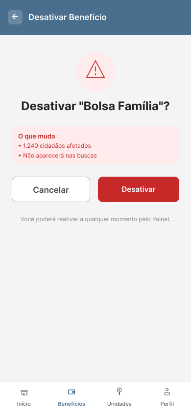</td>
<td width="25%">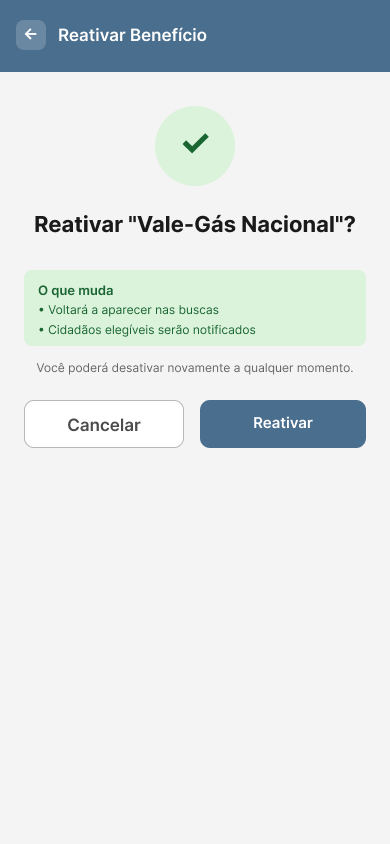</td>
<td width="25%">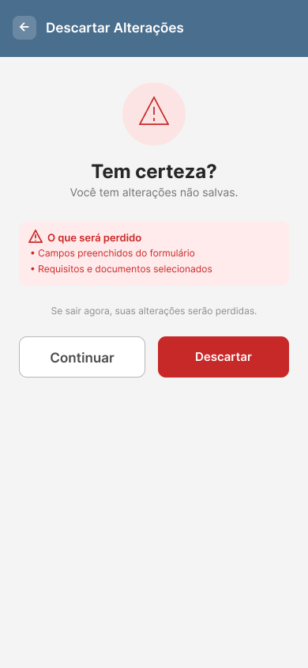</td>
<td width="25%">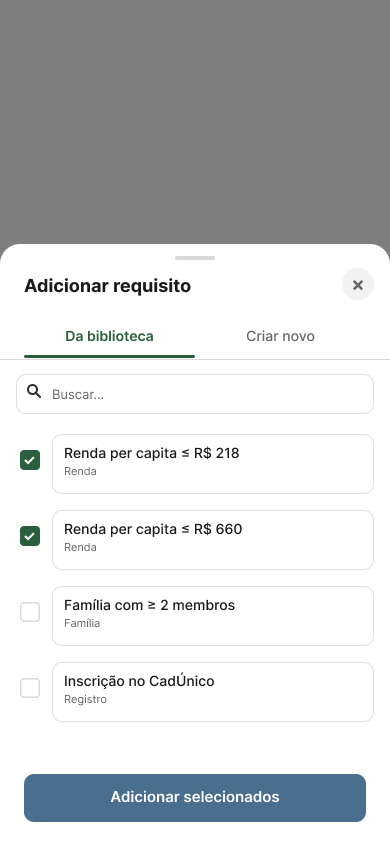</td>
</tr>
<tr>
<td align="center">Confirmar Desativação</td>
<td align="center">Confirmar Reativação</td>
<td align="center">Descartar Alterações</td>
<td align="center">Adicionar Requisito</td>
</tr>
</tbody>
</table>

**Objetivo**

As quatro telas tratam de situações de risco, reuso e proteção contra perda de dados. As três primeiras são modais de confirmação que antecedem ações com impacto sobre o sistema ou sobre dados em curso: desativar um benefício, reativar um benefício previamente desativado e descartar alterações de um formulário em edição. A quarta é um bottom sheet acionado dentro da edição de benefício e permite associar requisitos já cadastrados na biblioteca ou criar um novo requisito sem sair do contexto.

**Princípios Gestálticos**

- Figura e fundo: nas três telas de confirmação, o ícone central em círculo (alerta nas desativações e descarte, check na reativação) recebe destaque sobre o fundo neutro e indica o tipo de ação. No bottom sheet, o backdrop escurecido foca a atenção no painel inferior.
- Proximidade: a "Caixa de Impacto" reúne as consequências da ação em um único container, deixando claro que descrevem o mesmo evento. No bottom sheet, as abas "Da biblioteca" e "Criar novo" ficam lado a lado e indicam alternativas para a mesma intenção.
- Semelhança: as três telas de confirmação compartilham a mesma estrutura: ícone, título, caixa de impacto, texto de reversibilidade e dois botões. Os itens do bottom sheet seguem o mesmo formato dos itens da Biblioteca de Requisitos.
- Continuidade: a leitura de cima para baixo nas telas de confirmação acompanha a progressão alerta, pergunta, impacto, reversibilidade e ação.
- Fechamento: cada Caixa de Impacto e o cartão do bottom sheet têm cantos arredondados que separam essas regiões do restante da tela.

**Regras de Ouro**

- Prevenção de erros: as três telas de confirmação interrompem ações de alto impacto e exigem um passo intermediário antes da execução. A tela de Descartar Alterações protege contra perda acidental de dados em formulários.
- Feedback informativo: cada Caixa de Impacto detalha as consequências em linguagem direta, com frases como "1.240 cidadãos afetados", "8 benefícios serão reavaliados", "Cidadãos elegíveis serão notificados" e "Campos preenchidos do formulário".
- Reversão de ações: textos como "Você poderá reativar a qualquer momento pelo Painel" e "Você poderá desativar novamente a qualquer momento" reduzem o medo de errar. A tela de Reativação demonstra na prática que a desativação não é permanente.
- Diálogos que indicam fim de ação: dois botões claros em cada confirmação ("Cancelar" e "Confirmar", "Desativar" ou "Reativar") encerram o fluxo de forma inequívoca.
- Senso de controle: no bottom sheet, o usuário escolhe entre reusar um requisito existente ou criar um novo sem sair da edição. Backdrop clicável e botão de fechar (×) oferecem saída imediata, e a busca interna acelera a localização.
- Redução da carga de memória de curto prazo: a aba "Da biblioteca" lista os requisitos disponíveis com checkboxes e seleção múltipla, e o usuário não precisa lembrar nomes ou parâmetros exatos.
- Consistência: o padrão "Caixa de Impacto, texto de reversibilidade, dois botões" se repete em todas as confirmações de desativação dos quatro domínios e na tela de Reativação. O bottom sheet é replicado para "Adicionar Documento" com a mesma estrutura.

**Recomendações Ergonômicas**

- Posicionamento: o bottom sheet ocupa a parte inferior da tela, dentro do alcance do polegar em uso de uma só mão. Os modais de confirmação são centralizados verticalmente, com o ícone como ponto focal.
- Áreas de toque: botões com altura entre 48px e 52px nos modais; checkboxes do bottom sheet com 20px e área expandida; drag handle e ícone de fechar (×) com 32px.
- Hierarquia visual: pergunta principal em fonte grande nas confirmações ("Desativar Bolsa Família?", "Reativar Vale-Gás Nacional?", "Tem certeza?"), com detalhes em fonte menor.
- Distinção entre ações: botão primário à direita, botão secundário ("Cancelar") à esquerda, com separação horizontal suficiente. Cores diferenciam ações construtivas (reativação) de destrutivas (desativação e descarte).
- Linguagem simples: os textos evitam jargão técnico ("O que muda", "O que será perdido", "Você poderá reativar"), atendendo ao RNF05.

---

## 4.4 Testes com Protótipos

Nesta seção você deve apresentar os testes realizados com usuários utilizando os protótipos de alta fidelidade desenvolvidos na seção anterior. O objetivo é avaliar a usabilidade, a clareza das informações e a adequação do design às necessidades das personas definidas no projeto.

Cada integrante do grupo deverá aplicar o teste com um usuário distinto, preferencialmente alinhado ao perfil das personas criadas. Devem ser definidas previamente as tarefas que o usuário deverá executar no protótipo (por exemplo: realizar um cadastro, buscar um produto, concluir uma compra).

Durante a aplicação do teste, registre observações sobre comportamentos, dúvidas, erros e comentários feitos pelo usuário, bem como o tempo necessário para a execução de cada tarefa. Ao final, colete o feedback do participante, destacando pontos positivos e aspectos a serem melhorados.

Os resultados obtidos por todos os integrantes devem ser consolidados, apresentando uma análise geral com os principais problemas encontrados, oportunidades de melhoria e as ações previstas para o projeto final.
