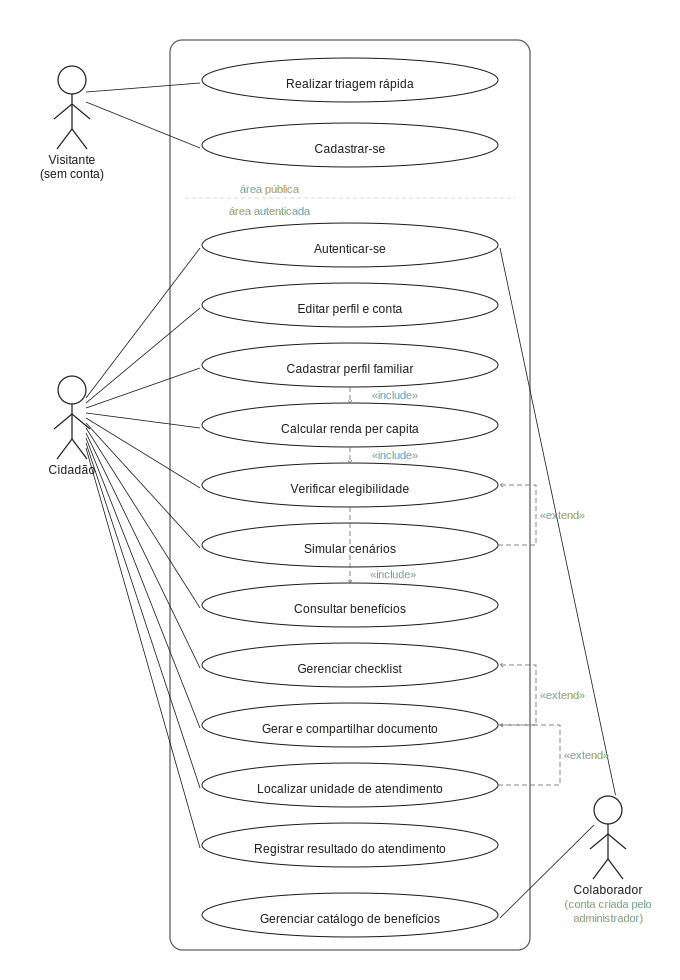
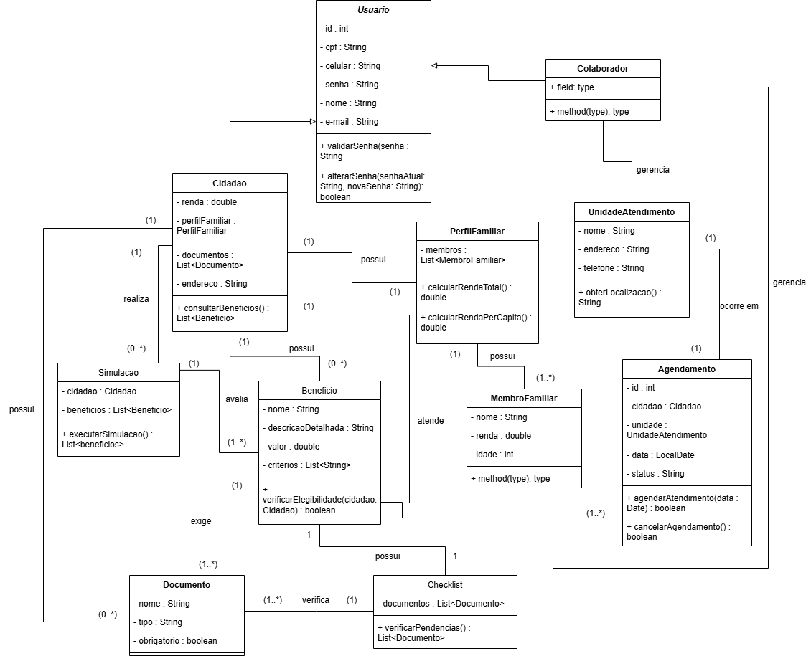

# 3. DOCUMENTO DE ESPECIFICAÇÃO DE REQUISITOS DE SOFTWARE

## 3.1 Objetivos deste documento

O principal objetivo deste documento é detalhar as necessidades e funcionalidades do sistema web GuiaCidadão, destacando o público-alvo e demonstrando as metas a serem cumpridas. Além do objetivo principal, serve também como referência para desenvolvedores, usuários e demais interessados, garantindo clareza quanto a missão principal do sistema e o atingimento dos requisitos citados.

## 3.2 Escopo do produto

### 3.2.1 Nome do produto e seus componentes principais

O produto será denominado GuiaCidadão, que consiste em um sistema web para cidadãos em vulnerabilidade socioeconômica e visitantes que buscam informações centralizadas sobre os benefícios sociais disponibilizados pelo governo. Seus componentes principais são o sistema de cadastro socioeconômico familiar, sistema de elegibilidade para benefícios e o sistema de cálculo de renda familiar.

### 3.2.2 Missão do produto

Centralizar os benefícios sociais distribuídos pelo governo em uma plataforma única, criando um ambiente dinâmico, interativo e intuitivo aos usuários. Além da centralização, a plataforma também auxilia na identificação de benefícios que competem ao usuário, através de informações socioeconômicas, cálculo de renda familiar e demais informações do usuário. Apesar de todas as funções, a plataforma também se torna um acesso rápido aos visitantes que apenas buscam informações sobre os benefícios sociais, sem necessidade de cadastro. 

### 3.2.3 Limites do produto

O sistema web ficará condicionado ao cadastro e à atualização manual dos benefícios sociais e das unidades de atendimento pelo Colaborador, além de utilizar banco de dados simulado em armazenamento local para fins de testagem de suas funcionalidades.

### 3.2.4 Benefícios do produto

| # | Benefício | Valor para o Cliente |
|--------------------|------------------------------------|----------------------------------------|
|1	| Concentração e simplificação de informações a respeito de auxílios sociais |	Essencial |
|2 | Visualização limpa e objetiva dos benefícios elegíveis | Essencial | 
|3 | Auxílio direto no processo de cálculo de renda familiar | Essencial |
|4	| Checklist para controle dos documentos necessários para cada benefício	| Recomendável | 
|5	| Criação de um documento resumido sobre a situação do beneficiário	| Desejável | 
|6	| Localização da Unidade de Atendimento mais próxima	| Desejável | 

## 3.3 Descrição geral do produto

Para garantir que a solução proposta atenda de forma efetiva às dores do público-alvo, o levantamento e o gerenciamento dos requisitos basearam-se em práticas de Engenharia de Requisitos aplicadas a contextos ágeis e ao Design Centrado no Usuário.

### 3.3.1 Técnicas de Elicitação

Para compreender os pontos de conflito e as necessidades dos usuários, frequentemente impactados pela "vulnerabilidade informacional", utilizamos as seguintes técnicas de elicitação:
* **Análise de Documentos e Sistemas (Benchmarking):** Avaliação de plataformas governamentais existentes (como o portal Meu INSS e CadÚnico) para identificar gargalos de usabilidade, excesso de jargões técnicos e falhas na arquitetura de informação.
* **Pesquisa de Estado da Arte:** Revisão da literatura para mapear as barreiras informacionais, técnicas e burocráticas enfrentadas por pessoas com baixo letramento digital.
* **Criação de Personas e Jornada do Usuário:** Desenvolvimento de perfis representativos do nosso público-alvo, simulando cenários e caminhos que esses usuários percorrem ao tentar descobrir e acessar benefícios sociais.

### 3.3.2 Ideação e Validação de Hipóteses

A partir das necessidades levantadas, o processo de ideação permitiu estruturar soluções baseadas em hipóteses validadas pela pesquisa formal:
* **Hipótese 1:** Interfaces densas e linguagem jurídica afastam os usuários (evidenciado pelos estudos de Freitas e Bernardo). **Solução:** Implementação do requisito não funcional de "Linguagem Simples" (RNF09), garantindo que termos técnicos sejam traduzidos de forma acessível.
* **Hipótese 2:** A exigência de um cadastro longo antes de qualquer entrega de valor gera alta taxa de abandono. **Solução:** Criação da funcionalidade de "Triagem Rápida" (CSU07), que permite ao visitante obter um diagnóstico preliminar respondendo apenas a perguntas objetivas sem necessidade de autenticação.

### 3.3.3 Gerenciamento de Mudanças de Requisitos

Em conformidade com os princípios de desenvolvimento ágil, os requisitos documentados são passíveis de evolução. O gerenciamento das mudanças será realizado através das seguintes práticas:
* **Backlog do Produto:** Manutenção de um repositório centralizado através de quadros Kanban (utilizando as ferramentas de *Projects/Issues* do GitHub) para registro de novas necessidades, alterações ou correções.
* **Revisões de Sprint:** Reavaliação constante e repriorização dos requisitos a cada ciclo de iteração, garantindo que o foco permaneça na entrega de valor.
* **Rastreabilidade:** Toda alteração significativa deverá ser refletida neste artefato de especificação e vinculada às respectivas *issues*, garantindo controle do impacto de escopo e histórico de decisões do projeto.

## 3.4 Especificação de Requisitos

### 3.4.1 Requisitos Funcionais

| Código | Requisito Funcional (Funcionalidade) | Descrição | Prioridade |
|--------|--------------------------------------|-----------|------------|
| RF01 | Cadastro de cidadão | O cidadão cria uma conta no sistema, informando nome completo, CPF, data de nascimento, senha e ao menos um canal de contato (e-mail ou telefone). | Alta |
| RF02 | Autenticação | O cidadão, o colaborador e o administrador autenticam-se no sistema e recuperam seu acesso por meio de código enviado ao canal de contato cadastrado. | Alta |
| RF03 | Gestão de perfil | O cidadão, o colaborador e o administrador editam seus dados cadastrais, alteram sua senha e excluem sua conta. | Alta |
| RF04 | Gestão do perfil familiar | O cidadão gerencia os dados socioeconômicos do seu núcleo familiar (membros, rendas, vínculo empregatício, condição de moradia e CEP), com cálculo automático da renda total e per capita. | Alta |
| RF05 | Verificação de elegibilidade | O cidadão consulta os benefícios compatíveis com seu perfil, classificados como elegíveis, potencialmente elegíveis ou não elegíveis. | Alta |
| RF06 | Simulação de cenários | O cidadão simula alterações no seu perfil para analisar o impacto na sua elegibilidade, sem afetar seus dados reais, podendo armazenar até cinco simulações salvas por conta. | Média |
| RF07 | Consulta detalhada de benefício | O cidadão consulta a descrição, os critérios, os documentos exigidos e o link oficial de cada benefício, em linguagem simples. | Alta |
| RF08 | Preenchimento de checklist | O cidadão preenche o checklist de documentos exigidos para cada benefício elegível, marcando cada item como pendente, obtido ou não aplicável. | Média |
| RF09 | Triagem rápida | O visitante realiza uma triagem rápida e obtém uma lista preliminar de benefícios compatíveis, sem necessidade de cadastro. | Alta |
| RF10 | Geração e compartilhamento de documento | O cidadão gera um PDF com o resumo da sua situação e o compartilha via WhatsApp ou impressão. | Baixa |
| RF11 | Localização de unidade de atendimento | O cidadão consulta a unidade de atendimento mais próxima a partir do CEP ou da geolocalização, com nome, endereço, distância e horário de funcionamento. | Baixa |
| RF12 | Registro de resultado de atendimento presencial | O cidadão registra o resultado do atendimento presencial (protocolado, documentação complementar, concedido ou indeferido), atualizando o status do benefício. | Média |
| RF13 | Gestão do catálogo de benefícios | O colaborador gerencia o catálogo de benefícios e seus critérios de elegibilidade (inclusão, edição, desativação e consulta). | Alta |
| RF14 | Gestão de unidades de atendimento | O colaborador gerencia as unidades de atendimento (inclusão, edição, desativação e consulta). | Alta |
| RF15 | Gestão de contas de colaborador | O administrador gerencia as contas de colaborador (inclusão, edição, desativação e consulta). | Alta |
| RF16 | Notificação a usuários afetados | O sistema notifica cidadãos afetados por alterações no catálogo de benefícios (mudança em critérios, lista de documentos ou desativação) pelo canal de contato preferencial cadastrado. | Média |
| RF17 | Reavaliação automática de elegibilidade | Sempre que um critério de elegibilidade for alterado pelo Colaborador, o sistema reexecuta a verificação de elegibilidade (CSU03) para todos os perfis que possuíam classificação anterior para aquele benefício. | Média |

### 3.4.2 Requisitos Não Funcionais

| Código | Requisito Não Funcional (Restrição) | Prioridade |
|--------|-------------------------------------|------------|
| RNF01 | O cálculo da renda per capita deve ser exibido em até 2 segundos após a submissão do formulário. | Alta |
| RNF02 | O sistema deve funcionar nos navegadores Chrome, Firefox e Safari em suas versões atualizadas. | Média |
| RNF03 | A interface deve atender às diretrizes WCAG 2.1 nível AA. | Alta |
| RNF04 | O sistema deve realizar backup diário automatizado dos dados, com retenção mínima de 30 dias. | Alta |
| RNF05 | O sistema deve obter consentimento LGPD explícito do cidadão no momento do cadastro. | Alta |
| RNF06 | O sistema deve processar solicitações de exclusão de dados pessoais em até 15 dias úteis, em conformidade com a LGPD. | Alta |
| RNF07 | O sistema deve validar formato e dígitos verificadores do CPF no momento da submissão do cadastro. | Alta |
| RNF08 | O sistema deve controlar o acesso a funcionalidades e rotas por perfil de usuário, bloqueando requisições incompatíveis. | Alta |
| RNF09 | O sistema deve apresentar todos os conteúdos voltados ao cidadão em linguagem simples, traduzindo termos jurídicos e administrativos para expressões acessíveis a pessoas com baixo letramento digital. | Alta |
| RNF10 | O sistema deve exigir senhas com no mínimo 8 caracteres e bloquear temporariamente o identificador após três tentativas consecutivas de autenticação falhas, por um período de 15 minutos. | Alta |
| RNF11 | O sistema deve localizar unidades de atendimento em raio inicial de 5 km e ampliar progressivamente em incrementos de 5 km até 25 km quando nenhuma unidade for encontrada. | Média |

### 3.4.3 Usuários 

| Ator | Descrição |
|--------------------|------------------------------------|
| Cidadão |	Usuário primário do sistema. Pessoa em situação de vulnerabilidade socioeconômica (desempregada, trabalhadora informal, MEI ou idosa) que busca compreender seus direitos e identificar benefícios sociais compatíveis com seu perfil. Caracteriza-se por acesso básico à tecnologia, geralmente via smartphone, e pode apresentar baixo letramento digital. |
| Colaborador | Usuário interno responsável pela manutenção do conteúdo da plataforma: atualização das informações sobre benefícios, critérios de elegibilidade e listas de documentos. Não realiza atendimento direto ao cidadão, atuando na camada administrativa e de curadoria do sistema. Sua conta é criada pelo administrador do sistema, que fornece as credenciais de acesso provisórias. No primeiro acesso, o Colaborador é obrigado a definir uma senha definitiva. |
| Visitante | Pessoa que acessa o sistema sem conta cadastrada. Pode realizar a triagem rápida de elegibilidade e visualizar o resultado preliminar. Não tem acesso às funcionalidades que exigem autenticação. |
| Administrador | Usuário interno com perfil de maior privilégio, responsável pela criação, edição, desativação e auditoria das contas de Colaborador (CSU13). Não edita o catálogo de benefícios nem o cadastro de unidades de atendimento, atribuições que pertencem ao Colaborador, e não interage diretamente com os cidadãos. |

## 3.5 Modelagem do Sistema

### 3.5.1 Diagrama de Casos de Uso
O diagrama de casos de uso da Figura 1 apresenta os quatro usuários do sistema e os casos em que cada um participa.

Na área pública, o Visitante pode realizar a triagem rápida ou iniciar o próprio cadastro. Após o cadastro e a autenticação, o Cidadão acessa a área autenticada, na qual encontra o diagnóstico de elegibilidade, o checklist de documentos, a simulação de cenários, a geração de documento e o registro do resultado do atendimento presencial.

O Colaborador e o Administrador acessam o painel administrativo. O Colaborador é responsável pela manutenção do catálogo de benefícios (CSU11) e do cadastro das unidades de atendimento (CSU12). O Administrador atua apenas na gestão das contas de Colaborador (CSU13).

#### Figura 1: Diagrama de Casos de Uso do Sistema.

 
### 3.5.2 Descrições de Casos de Uso

#### Gerenciar Conta (CSU01)

Sumário: O Cidadão ou Colaborador realiza a gestão da sua conta no sistema, incluindo cadastro, autenticação, edição de dados e exclusão de conta. Contas de Colaborador são criadas pelo administrador do sistema e não estão disponíveis para autoatendimento.

Ator Primário: Cidadão.

Ator Secundário: Colaborador.

Pré-condições: Nenhuma para cadastro e autenticação de Cidadão. Para edição e exclusão, o usuário deve estar autenticado no Sistema. Para autenticação de Colaborador, a conta deve ter sido previamente criada pelo administrador do sistema.

Fluxo Principal:

1) O usuário acessa o sistema.
2) O Sistema apresenta as opções disponíveis: cadastrar nova conta, autenticar-se, editar dados, alterar senha ou excluir conta.
3) O usuário seleciona a operação desejada ou opta por encerrar.
4) Se o usuário desejar continuar, o caso de uso retorna ao passo 2; caso contrário, encerra.

Fluxo Alternativo (3): Cadastro de Cidadão

a) O Cidadão requisita a criação de uma nova conta.  
b) O Sistema apresenta formulário solicitando nome completo, CPF, data de nascimento, senha e ao menos um canal de contato obrigatório: e-mail ou telefone celular.  
c) O Cidadão preenche os dados e confirma.  
d) O Sistema valida o formato e os dígitos verificadores do CPF informado. Se o CPF for inválido, reporta o erro e solicita correção antes de prosseguir.  
e) O Sistema verifica se já existe conta vinculada ao CPF informado. Se sim, reporta o fato e retorna ao passo 2; caso contrário, cria a conta e redireciona o Cidadão para o preenchimento do perfil familiar.  

Fluxo Alternativo (3): Autenticação de Cidadão

a) O Cidadão informa CPF e senha.  
b) O Sistema valida as credenciais. Se válidas, concede acesso; caso contrário, reporta o erro e permite nova tentativa.  
c) Após três tentativas consecutivas com falha, o Sistema bloqueia temporariamente o acesso e orienta o Cidadão a utilizar a recuperação de senha.  

Fluxo Alternativo (3): Autenticação de Colaborador

a) O Colaborador acessa a área administrativa do sistema e informa e-mail institucional e senha provisória fornecida pelo administrador.  
b) O Sistema valida as credenciais e identifica o perfil como Colaborador. Se válidas, concede acesso ao painel administrativo; caso contrário, reporta o erro e permite nova tentativa.  
c) Após três tentativas consecutivas com falha, o Sistema bloqueia temporariamente o acesso e notifica o administrador responsável.  
d) No primeiro acesso, o Sistema exige a troca da senha provisória por uma senha definitiva antes de prosseguir.  

Fluxo Alternativo (3): Recuperação de senha

a) O usuário informa o CPF ou e-mail cadastrado e solicita a recuperação de senha.  
b) O Sistema localiza a conta e exibe parcialmente o e-mail e o telefone cadastrados para que o usuário escolha por qual canal deseja receber o código de verificação.  
c) O Sistema envia um código de verificação temporário ao canal escolhido.  
d) O usuário informa o código recebido. O Sistema valida o código e, se correto, permite a definição de uma nova senha; caso contrário, reporta o erro e permite nova tentativa.  

Fluxo Alternativo (3): Edição de dados

a) O usuário altera um ou mais campos do cadastro, incluindo e-mail ou telefone, e confirma a atualização.  
b) O Sistema valida os dados informados. Se válidos, salva as alterações; caso contrário, reporta o erro e solicita correção.  

Fluxo Alternativo (3): Exclusão de conta

a) O Cidadão solicita a exclusão da conta.  
b) O Sistema solicita confirmação e informa que todos os dados serão removidos permanentemente.  
c) O Cidadão confirma. O Sistema exclui os dados do usuário em conformidade com a LGPD e encerra a sessão.  

Pós-condições: Uma conta de Cidadão foi criada, o usuário foi autenticado, sua senha foi redefinida, seus dados foram atualizados ou a conta foi excluída.

---

#### Cadastrar Perfil Familiar (CSU02)

Sumário: O Cidadão registra os dados socioeconômicos do seu núcleo familiar, que servirão de base para o cálculo de renda e a verificação de elegibilidade a benefícios.

Ator Primário: Cidadão.

Pré-condições: O Cidadão deve estar autenticado no Sistema.

Fluxo Principal:

1) O Cidadão acessa a seção de perfil familiar.
2) O Sistema apresenta formulário solicitando: número de membros do núcleo familiar, renda mensal de cada membro, vínculo empregatício de cada membro, condição de moradia e CEP de residência (campo opcional).
3) O Cidadão preenche os dados e confirma.
4) O Sistema valida as informações e calcula a renda familiar total e a renda per capita, aplicando as regras definidas em RF04. Os valores calculados ficam disponíveis para CSU03 (Verificar Elegibilidade) e CSU04 (Simular Cenários).
5) O Sistema salva o perfil e exibe um resumo com os valores calculados.
6) O Cidadão confirma os dados ou opta por corrigir.

Fluxo Alternativo (3): Dados incompletos

a) O Cidadão submete o formulário com campos obrigatórios em branco.  
b) O Sistema identifica os campos pendentes, destaca-os na tela e solicita o preenchimento antes de prosseguir. O CEP, por ser opcional, não bloqueia o avanço caso não seja informado.  

Fluxo Alternativo (6): Correção de dados

a) O Cidadão identifica erro nos valores exibidos e solicita edição.  
b) O Sistema reapresenta o formulário com os dados atuais para correção.  
c) Após a correção, o fluxo retorna ao passo 4.  

Pós-condições: O perfil familiar do Cidadão foi salvo no Sistema com renda total e per capita calculadas. O CEP, quando informado, fica disponível para identificação automática da unidade de atendimento mais próxima.

---

#### Verificar Elegibilidade (CSU03)

Sumário: O Sistema analisa o perfil socioeconômico do Cidadão e identifica os benefícios sociais para os quais ele potencialmente atende os critérios de elegibilidade.

Ator Primário: Cidadão.

Pré-condições: O perfil socioeconômico familiar deve estar preenchido. O Cidadão deve estar autenticado no Sistema.

Fluxo Principal:

1) O Sistema recupera o perfil socioeconômico do Cidadão.
2) O Sistema percorre o catálogo de benefícios cadastrados e aplica os critérios de elegibilidade de cada um ao perfil do Cidadão.
3) O Sistema classifica cada benefício em: elegível, potencialmente elegível ou não elegível.
4) O Sistema exibe a lista de benefícios elegíveis e potencialmente elegíveis, com indicação do critério que determinou cada classificação.
5) O Sistema redireciona o Cidadão para a consulta detalhada dos benefícios identificados (CSU05).

Fluxo Alternativo (3): Nenhum benefício elegível identificado

a) O Sistema não encontra benefícios que atendam ao perfil informado.  
b) O Sistema informa o fato ao Cidadão em linguagem simples, explica quais critérios não foram atendidos e sugere a simulação de cenários (CSU04) para explorar possibilidades.  

Fluxo Alternativo (3): Dados insuficientes para avaliação

a) O Sistema identifica que campos do perfil relevantes para determinado benefício não foram preenchidos.  
b) O Sistema sinaliza quais informações estão faltando e orienta o Cidadão a completar o perfil antes de prosseguir.  

Pós-condições: Os benefícios compatíveis com o perfil do Cidadão foram identificados e listados no painel do usuário.

---

#### Simular Cenários (CSU04)

Sumário: O Cidadão simula alterações no seu perfil socioeconômico para analisar o impacto na elegibilidade a benefícios, sem alterar os dados reais cadastrados.

Ator Primário: Cidadão.

Pré-condições: O perfil familiar deve estar preenchido. O Cidadão deve estar autenticado no Sistema.

Fluxo Principal:

1) O Cidadão acessa a funcionalidade de simulação.
2) O Sistema carrega uma cópia do perfil atual do Cidadão para edição temporária.
3) O Cidadão altera um ou mais campos do perfil simulado (ex.: redução de renda, inclusão de dependente, mudança de vínculo empregatício).
4) O Sistema recalcula a renda per capita com os dados simulados e reavalia a elegibilidade aos benefícios.
5) O Sistema exibe o resultado da simulação lado a lado com a situação atual, destacando as mudanças na elegibilidade.
6) O Cidadão pode salvar o resultado como referência ou descartar a simulação.

Fluxo Alternativo (6): Salvar simulação

a) O Cidadão opta por salvar o cenário simulado como referência.  
b) O Sistema armazena o resultado da simulação associado ao perfil do Cidadão, sem sobrescrever os dados reais. O Sistema limita o armazenamento a cinco simulações salvas por usuário, orientando o Cidadão a excluir simulações antigas caso o limite seja atingido.  

Fluxo Alternativo (3): Múltiplas simulações

a) O Cidadão deseja testar mais de um cenário.  
b) O Sistema permite a criação de novas simulações a partir do perfil real, mantendo os cenários anteriores salvos para comparação, respeitando o limite de cinco simulações por usuário.  

Pós-condições: O resultado da simulação foi exibido. Os dados reais do Cidadão permanecem inalterados.

---

#### Consultar Benefícios (CSU05)

Sumário: O Cidadão consulta as informações detalhadas sobre os benefícios sociais identificados como elegíveis em seu perfil, apresentadas em linguagem simples.

Ator Primário: Cidadão.

Pré-condições: Ao menos um benefício elegível deve ter sido identificado (CSU03). O Cidadão deve estar autenticado no Sistema.

Fluxo Principal:

1) O Cidadão acessa a lista de benefícios identificados no seu painel.
2) O Sistema exibe os benefícios com nome, descrição resumida em linguagem simples e classificação de elegibilidade.
3) O Cidadão seleciona um benefício para ver os detalhes.
4) O Sistema exibe: descrição completa do benefício, critérios de elegibilidade traduzidos para linguagem simples, lista de documentos exigidos e link para a fonte oficial do governo.
5) O Cidadão pode acessar o checklist de documentos do benefício selecionado (CSU06).

Fluxo Alternativo (3): Benefício não elegível selecionado

a) O Cidadão seleciona um benefício classificado como não elegível para entender o motivo.  
b) O Sistema exibe quais critérios não foram atendidos e orienta sobre o que precisaria mudar no perfil para que o benefício se tornasse elegível.  

Pós-condições: O Cidadão visualizou as informações detalhadas do benefício selecionado em linguagem acessível.

---

#### Gerenciar Checklist de Documentos (CSU06)

Sumário: O Sistema gera automaticamente a lista de documentos necessários para cada benefício elegível e o Cidadão gerencia o status de cada item conforme avança na instrução do processo.

Ator Primário: Cidadão.

Pré-condições: Ao menos um benefício elegível deve ter sido identificado (CSU03). O Cidadão deve estar autenticado no Sistema.

Fluxo Principal:

1) O Sistema gera automaticamente, para cada benefício elegível, a lista de documentos exigidos para solicitação.
2) O Sistema exibe o checklist com todos os itens marcados como pendentes.
3) O Cidadão marca os documentos que já possui como obtidos.
4) O Sistema atualiza o progresso e recalcula o percentual de conclusão do checklist.
5) O Cidadão pode consultar, para cada documento, uma orientação sobre onde e como obtê-lo.

Fluxo Alternativo (3): Marcar documento como não aplicável

a) O Cidadão identifica que determinado documento não se aplica à sua situação.  
b) O Sistema permite marcar o item como não aplicável, mediante confirmação, e exclui o item do cálculo de progresso.  

Fluxo Alternativo (5): Gerar e compartilhar documento

a) O Cidadão solicita a exportação ou compartilhamento do checklist.  
b) O Sistema aciona o CSU08 — Gerar e Compartilhar Documento.  

Pós-condições: O checklist foi gerado, atualizado com os status informados pelo Cidadão e o progresso foi registrado no painel.

---

#### Realizar Triagem Rápida (CSU07)

Sumário: O Visitante responde a um conjunto reduzido de perguntas objetivas e recebe uma lista preliminar de benefícios potencialmente compatíveis com seu perfil, sem necessidade de cadastro. Caso opte por criar uma conta, o resultado da triagem é aproveitado no perfil sem necessidade de repreenchimento.

Ator Primário: Visitante.

Pré-condições: Nenhuma. A funcionalidade é acessível sem autenticação.

Fluxo Principal:

1) O Visitante acessa o sistema pela primeira vez.
2) O Sistema apresenta a triagem rápida como ponto de entrada, com explicação em linguagem simples sobre o que será perguntado.
3) O Sistema apresenta a primeira pergunta: composição do núcleo familiar (número de pessoas).
4) O Visitante seleciona uma das opções apresentadas.
5) O Sistema apresenta a segunda pergunta: faixa de renda per capita mensal do núcleo.
6) O Visitante seleciona uma das opções apresentadas.
7) O Sistema apresenta a terceira pergunta: situação de vínculo empregatício do responsável familiar.
8) O Visitante seleciona uma das opções apresentadas.
9) O Sistema processa as respostas e exibe a lista de benefícios potencialmente compatíveis, com indicação do grau de compatibilidade de cada um.
10) O Sistema apresenta convite para criação de conta, explicando que o cadastro permite salvar o resultado, detalhar o perfil e gerar o checklist de documentos.

Fluxo Alternativo (9): Nenhum benefício compatível identificado

a) O Sistema não identifica benefícios compatíveis com as respostas fornecidas.  
b) O Sistema informa o fato em linguagem simples, explica quais critérios não foram atendidos e sugere a criação de conta para uma análise mais detalhada do perfil.  

Fluxo Alternativo (10): Visitante opta por criar conta

a) O Visitante aceita o convite e inicia o cadastro.  
b) O Sistema armazena temporariamente as respostas da triagem associadas à sessão atual.  
c) Após a conclusão do cadastro, o Sistema importa automaticamente as respostas da triagem como base do perfil familiar, exibindo os dados pré-preenchidos para revisão e complemento pelo Cidadão.  
d) O Cidadão revisa os dados importados, complementa as informações faltantes e confirma. O fluxo segue para o CSU02.  

Fluxo Alternativo (10): Visitante opta por não se cadastrar

a) O Visitante ignora o convite de cadastro.  
b) O Sistema mantém o resultado da triagem visível na sessão atual. Os dados não são persistidos após o encerramento da sessão.  

Pós-condições: O Visitante visualizou uma lista preliminar de benefícios compatíveis com seu perfil. Caso tenha criado conta, as respostas da triagem foram importadas como base do perfil familiar sem necessidade de repreenchimento.

---

#### Gerar e Compartilhar Documento (CSU08)

Sumário: O Cidadão exporta ou compartilha um resumo completo da sua situação no sistema — contendo os benefícios identificados, os documentos necessários, o status de cada item e a unidade de atendimento mais próxima — em formato PDF, via WhatsApp ou impressão direta.

Ator Primário: Cidadão.

Pré-condições: O Cidadão deve estar autenticado no Sistema. O diagnóstico de elegibilidade deve ter sido executado ao menos uma vez (CSU03).

Fluxo Principal:

1) O Cidadão acessa a opção de exportar ou compartilhar disponível em qualquer tela do sistema.
2) O Sistema compõe automaticamente um documento resumo personalizado com as seguintes seções: identificação do cidadão (nome e data de geração), lista de benefícios elegíveis com grau de compatibilidade de cada um, checklist de documentos por benefício com status atualizado de cada item (obtido, pendente ou não aplicável), orientações em linguagem simples sobre onde e como obter cada documento pendente, e endereço, horário de funcionamento e distância da unidade de atendimento mais próxima.
3) O Sistema apresenta as opções de entrega disponíveis: gerar PDF para download, compartilhar via WhatsApp e imprimir.
4) O Cidadão seleciona a opção desejada.
5) O Sistema executa a entrega conforme a opção escolhida.

Fluxo Alternativo (2): CEP não informado e geolocalização indisponível

a) O Sistema identifica que o CEP não foi informado no perfil e que não há geolocalização ativa na sessão.  
b) O Sistema solicita que o Cidadão informe o CEP ou bairro de residência para identificar a unidade de atendimento mais próxima.  
c) Se o Cidadão informar o CEP, o Sistema inclui a unidade identificada no documento. Se o Cidadão optar por não informar, o Sistema inclui no lugar uma orientação para consultar a unidade mais próxima no portal oficial do órgão responsável, com o link correspondente.  

Fluxo Alternativo (4): Gerar PDF

a) O Cidadão seleciona a opção de PDF.  
b) O Sistema gera o arquivo com layout limpo, fonte legível e linguagem simples, organizado em seções claramente separadas conforme o conteúdo descrito no passo 2.  
c) O Sistema disponibiliza o download do arquivo.  

Fluxo Alternativo (4): Compartilhar via WhatsApp

a) O Cidadão seleciona a opção de compartilhamento por WhatsApp.  
b) O Sistema gera uma versão resumida em texto simples com os benefícios identificados, os documentos ainda pendentes e o endereço da unidade de atendimento.  
c) O Sistema abre o WhatsApp com o conteúdo pré-preenchido, permitindo que o Cidadão escolha o destinatário.  

Fluxo Alternativo (4): Impressão

a) O Cidadão seleciona a opção de impressão.  
b) O Sistema abre a janela de impressão do navegador com o documento formatado em layout otimizado para papel, com margens adequadas e sem elementos de interface.  

Pós-condições: O documento foi entregue ao Cidadão no formato escolhido, contendo tudo que ele precisa saber para dar o próximo passo. O conteúdo do sistema permanece inalterado.

---

#### Localizar Unidade de Atendimento (CSU09)

Sumário: O Cidadão consulta as unidades de atendimento presencial relevantes para os benefícios identificados em seu perfil, com informações de endereço, horário e distância.

Ator Primário: Cidadão.

Pré-condições: Ao menos um benefício elegível deve ter sido identificado (CSU03). O Cidadão deve estar autenticado no Sistema.

Fluxo Principal:

1) O Cidadão acessa a tela de próximo passo de um benefício.
2) O Sistema identifica o tipo de unidade de atendimento competente para aquele benefício.
3) O Sistema verifica se o CEP foi informado no perfil familiar (CSU02). Se sim, utiliza o CEP como referência de localização; caso contrário, solicita autorização para utilizar a localização do dispositivo.
4) O Sistema exibe a unidade mais próxima com nome, endereço completo, distância aproximada e horário de funcionamento.
5) O Cidadão pode solicitar a exibição de outras unidades próximas ou visualizar a localização em mapa externo.

Fluxo Alternativo (3): CEP não informado no perfil e Cidadão autoriza geolocalização

a) O Sistema obtém a localização atual do dispositivo do Cidadão.  
b) O fluxo retorna ao passo 4.  

Fluxo Alternativo (3): CEP não informado e Cidadão não autoriza geolocalização

a) O Sistema apresenta campo de busca por CEP ou bairro para localização manual.  
b) O Cidadão informa o CEP ou bairro.  
c) O Sistema exibe as unidades mais próximas à localização informada.  

Fluxo Alternativo (4): Nenhuma unidade encontrada no raio de busca

a) O Sistema não localiza unidades no raio padrão de busca.  
b) O Sistema amplia automaticamente o raio de busca e informa o Cidadão.  
c) Se ainda assim nenhuma unidade for encontrada, o Sistema orienta o Cidadão a consultar o portal oficial do órgão responsável e exibe o link correspondente.  

Fluxo Alternativo (5): Visualizar no mapa

a) O Cidadão solicita a visualização da unidade em mapa.  
b) O Sistema abre o aplicativo de mapas do dispositivo ou o Google Maps no navegador com o endereço da unidade pré-carregado.  

Pós-condições: O Cidadão visualizou as informações da unidade de atendimento mais próxima e pode se dirigir ao local com as informações necessárias.

---

#### Registrar Resultado do Atendimento Presencial (CSU10)

Sumário: O Cidadão registra o resultado do atendimento presencial realizado em órgão competente, permitindo que o painel de acompanhamento reflita a situação real do processo após a saída do ambiente digital.

Ator Primário: Cidadão.

Pré-condições: O Cidadão deve ter ao menos um benefício com checklist em andamento. O Cidadão deve estar autenticado no Sistema.

Fluxo Principal:

1) O Cidadão acessa o painel de acompanhamento após realizar o atendimento presencial.
2) O Sistema exibe os benefícios com processos em andamento e apresenta a opção de registrar resultado do atendimento.
3) O Cidadão seleciona o benefício correspondente ao atendimento realizado.
4) O Sistema apresenta as opções de resultado: solicitação protocolada, documentação complementar solicitada, benefício concedido ou solicitação indeferida.
5) O Cidadão seleciona o resultado e confirma.
6) O Sistema atualiza o status do benefício no painel, registra a data do atendimento e exibe as orientações correspondentes ao resultado informado.

Fluxo Alternativo (5): Documentação complementar solicitada

a) O Cidadão informa que o órgão solicitou documentos adicionais não previstos no checklist original.  
b) O Sistema permite que o Cidadão adicione manualmente os novos itens ao checklist do benefício.  
c) O Sistema atualiza o progresso e orienta o Cidadão sobre os próximos passos.  

Fluxo Alternativo (5): Benefício concedido

a) O Cidadão informa que o benefício foi concedido.  
b) O Sistema marca o benefício como ativo no painel, registra a data de concessão e exibe mensagem de conclusão.  
c) O Sistema sugere a verificação de outros benefícios elegíveis ainda não solicitados.  

Fluxo Alternativo (5): Solicitação indeferida

a) O Cidadão informa que a solicitação foi indeferida.  
b) O Sistema pergunta se o Cidadão conhece o motivo do indeferimento e apresenta as opções mais comuns: renda acima do limite, documentação incompleta, cadastro desatualizado ou outro motivo.  
c) O Cidadão seleciona o motivo. O Sistema exibe orientações em linguagem simples sobre como proceder, incluindo possibilidade de recurso administrativo quando aplicável.  

Pós-condições: O resultado do atendimento presencial foi registrado no painel. O status do benefício foi atualizado e as orientações para os próximos passos foram exibidas ao Cidadão.

---

#### Gerenciar Catálogo de Benefícios (CSU11)

Sumário: O Colaborador realiza a gestão do catálogo de benefícios sociais disponíveis na plataforma, incluindo inclusão, edição, desativação e consulta de benefícios e seus critérios. Alterações nos critérios de elegibilidade ou na lista de documentos exigidos disparam a reavaliação automática dos perfis afetados e a sincronização dos checklists em andamento.

Ator Primário: Colaborador.

Pré-condições: O Colaborador deve estar autenticado com perfil administrativo no Sistema.

Fluxo Principal:

1) O Colaborador acessa o painel de gestão do catálogo.
2) O Sistema apresenta a lista de benefícios cadastrados com status (ativo/inativo) e data da última atualização.
3) O Colaborador seleciona a operação desejada: inclusão, edição, desativação ou consulta.
4) Se o Colaborador desejar continuar, o caso de uso retorna ao passo 2; caso contrário, encerra.

Fluxo Alternativo (3): Inclusão

a) O Colaborador requisita a inclusão de novo benefício.  
b) O Sistema apresenta formulário com os campos: nome do benefício, órgão responsável, descrição em linguagem simples, critérios de elegibilidade, lista de documentos exigidos e link para a fonte oficial.  
c) O Colaborador preenche os dados e confirma.  
d) O Sistema valida as informações e publica o benefício no catálogo, tornando-o disponível para a verificação de elegibilidade dos usuários.  

Fluxo Alternativo (3): Edição

a) O Colaborador seleciona um benefício e atualiza um ou mais campos.  
b) O Sistema identifica se a alteração afeta critérios de elegibilidade ou a lista de documentos exigidos.  
c) Se critérios de elegibilidade foram alterados, o Sistema agenda a reavaliação automática de todos os perfis que possuem aquele benefício classificado, notificando os usuários afetados pelo canal de contato cadastrado sobre eventual mudança na sua situação.  
d) Se a lista de documentos exigidos foi alterada, o Sistema sincroniza automaticamente todos os checklists em andamento daquele benefício, adicionando novos itens como pendentes ou removendo itens que deixaram de ser exigidos, e notifica os usuários afetados.  
e) O Sistema salva as alterações, registrando data e autor da modificação.  

Fluxo Alternativo (3): Desativação

a) O Colaborador seleciona um benefício e requisita sua desativação.  
b) O Sistema informa o número de usuários com aquele benefício ativo ou em andamento e solicita confirmação.  
c) O Colaborador confirma. O Sistema remove o benefício da exibição aos novos usuários, notifica os usuários com processo em andamento sobre a desativação e preserva o histórico sem excluir permanentemente.  

Fluxo Alternativo (3): Consulta

a) O Colaborador opta por pesquisar pelo nome ou órgão responsável e solicita a consulta sobre o catálogo.  
b) O Sistema apresenta a lista de benefícios correspondente aos termos pesquisados.  
c) O Colaborador seleciona um benefício.  
d) O Sistema apresenta os detalhes completos do benefício selecionado.  

Pós-condições: O catálogo de benefícios foi atualizado. Alterações em critérios de elegibilidade disparam reavaliação automática dos perfis afetados (RF17). Alterações na lista de documentos sincronizam os checklists em andamento. Os usuários afetados são notificados em ambos os casos (RF16).

---

#### Gerenciar Unidades de Atendimento (CSU12)

Sumário: O Colaborador realiza a gestão das unidades de atendimento presencial disponíveis na plataforma, incluindo inclusão, edição, desativação e consulta. O cadastro das unidades alimenta o CSU09 (Localizar Unidade de Atendimento) e o CSU08 (Gerar e Compartilhar Documento).

Ator Primário: Colaborador.

Pré-condições: O Colaborador deve estar autenticado como Colaborador no Sistema.

Fluxo Principal:

1) O Colaborador acessa o painel de gestão de unidades de atendimento.
2) O Sistema apresenta a lista de unidades cadastradas com status (ativa/inativa) e data da última atualização.
3) O Colaborador seleciona a operação desejada: inclusão, edição, desativação ou consulta, e o Sistema executa o fluxo alternativo correspondente.
4) Se o Colaborador desejar continuar, o caso de uso retorna ao passo 2; caso contrário, encerra.

Fluxo Alternativo (3): Inclusão

a) O Colaborador requisita a inclusão de nova unidade.  
b) O Sistema apresenta formulário com os campos: nome da unidade, tipo (CRAS, INSS, Defensoria Pública, outros), órgão responsável, endereço completo, CEP, horário de funcionamento, telefone de contato e tipos de benefícios atendidos.  
c) O Colaborador preenche os dados e confirma.  
d) O Sistema valida o CEP e o formato do endereço, geocodifica a localização e publica a unidade, tornando-a disponível para as consultas de CSU09.  

Fluxo Alternativo (3): Edição

a) O Colaborador seleciona uma unidade e atualiza um ou mais campos.  
b) O Sistema valida os dados e, em caso de alteração do endereço ou do CEP, refaz a geocodificação.  
c) O Sistema salva as alterações, registrando data e autor da modificação.  

Fluxo Alternativo (3): Desativação

a) O Colaborador seleciona uma unidade e requisita sua desativação.  
b) O Sistema solicita confirmação e informa que a unidade deixará de aparecer nas consultas de CSU09.  
c) O Colaborador confirma. O Sistema remove a unidade das consultas ativas, mas preserva o histórico, e sinaliza nas orientações de CSU10 caso a unidade esteja associada a processos em andamento.  

Fluxo Alternativo (3): Consulta

a) O Colaborador opta por pesquisar pelo nome, tipo, órgão responsável ou município da unidade.  
b) O Sistema apresenta a lista correspondente aos termos pesquisados.  
c) O Colaborador seleciona uma unidade e o Sistema apresenta os detalhes completos.  

Pós-condições: O cadastro de unidades de atendimento foi atualizado. As alterações refletem-se imediatamente nas consultas realizadas via CSU09.

---

#### Gerenciar Contas de Colaborador (CSU13)

Sumário: O Administrador realiza a gestão das contas dos Colaboradores na plataforma, incluindo inclusão, edição, desativação e consulta. A autenticação do Administrador segue o fluxo comum definido em CSU01 (3.b).

Ator Primário: Administrador.

Pré-condições: O Administrador deve estar autenticado no Sistema.

Fluxo Principal:

1) O Administrador acessa o painel de gestão de contas de Colaborador.
2) O Sistema apresenta a lista de Colaboradores cadastrados com status (ativo/inativo) e data do último acesso.
3) O Administrador seleciona a operação desejada: inclusão, edição, desativação ou consulta, e o Sistema executa o fluxo alternativo correspondente.
4) Se o Administrador desejar continuar, o caso de uso retorna ao passo 2; caso contrário, encerra.

Fluxo Alternativo (3): Inclusão de Colaborador

a) O Administrador requisita a criação de uma nova conta de Colaborador.  
b) O Sistema apresenta formulário solicitando: nome completo, CPF, e-mail institucional e áreas de atuação (catálogo de benefícios, unidades de atendimento ou ambos).  
c) O Administrador preenche os dados e confirma.  
d) O Sistema valida o formato e os dígitos verificadores do CPF (RNF07), verifica a unicidade do e-mail institucional, gera uma senha provisória e envia as credenciais ao e-mail informado, exigindo a troca no primeiro acesso (conforme CSU01 fluxo 3.b.d).  

Fluxo Alternativo (3): Edição

a) O Administrador seleciona uma conta de Colaborador e atualiza um ou mais campos, exceto o CPF (imutável).  
b) O Sistema valida os dados, salva as alterações e registra data e autor da modificação.  

Fluxo Alternativo (3): Desativação

a) O Administrador seleciona uma conta de Colaborador e requisita sua desativação.  
b) O Sistema solicita confirmação e informa que o Colaborador perderá o acesso ao painel administrativo, mas que o histórico de suas alterações no catálogo de benefícios e nas unidades de atendimento será preservado.  
c) O Administrador confirma. O Sistema desativa a conta e encerra qualquer sessão ativa do Colaborador.  

Fluxo Alternativo (3): Consulta

a) O Administrador opta por pesquisar pelo nome, CPF, e-mail ou status da conta.  
b) O Sistema apresenta a lista correspondente.  
c) O Administrador seleciona um Colaborador e o Sistema apresenta os detalhes completos, incluindo histórico resumido de alterações realizadas por ele.  

Pós-condições: O cadastro de contas de Colaborador foi atualizado. O Colaborador recém-incluído recebe credenciais provisórias no e-mail institucional informado e é obrigado a definir senha definitiva no primeiro acesso.

---

### 3.5.3 Diagrama de Classes 

A Figura 2 mostra o diagrama de classes do sistema. Ele ilustra as entidades principais da aplicação como Cidadão, Benefício, Checklist e Documento, bem como as relações entre o perfil socioeconômico e a simulação de elegibilidade do segurado.

#### Figura 2: Diagrama de Classes do Sistema.
 

### 3.5.4 Descrições das Classes

| # | Nome           | Descrição                                                                                                                                               |
| - | -------------- | ------------------------------------------------------------------------------------------------------------------------------------------------------- |
| 1 | Cidadao        | Representa o usuário principal do sistema, contendo informações pessoais, renda e dados necessários para análise de elegibilidade a benefícios sociais. |
| 2 | PerfilFamiliar | Armazena a composição familiar do cidadão, incluindo membros e renda total, sendo utilizado no cálculo de renda per capita.                             |
| 3 | MembroFamiliar | Representa cada integrante da família, contendo dados como nome, idade, salário e grau de parentesco.                                                   |
| 4 | Beneficio      | Contém as informações dos benefícios sociais disponíveis, incluindo critérios de elegibilidade, descrição e valor.                                      |
| 5 | Simulacao      | Responsável por realizar a análise de elegibilidade do cidadão em relação a um ou mais benefícios, com base nos critérios definidos.                    |
| 6 | Documento      | Representa os documentos necessários para solicitação de benefícios, incluindo tipo e status de entrega.                                                |
| 7 | Checklist      | Controla a lista de documentos exigidos para cada benefício, auxiliando o usuário no acompanhamento do processo.                                        |
